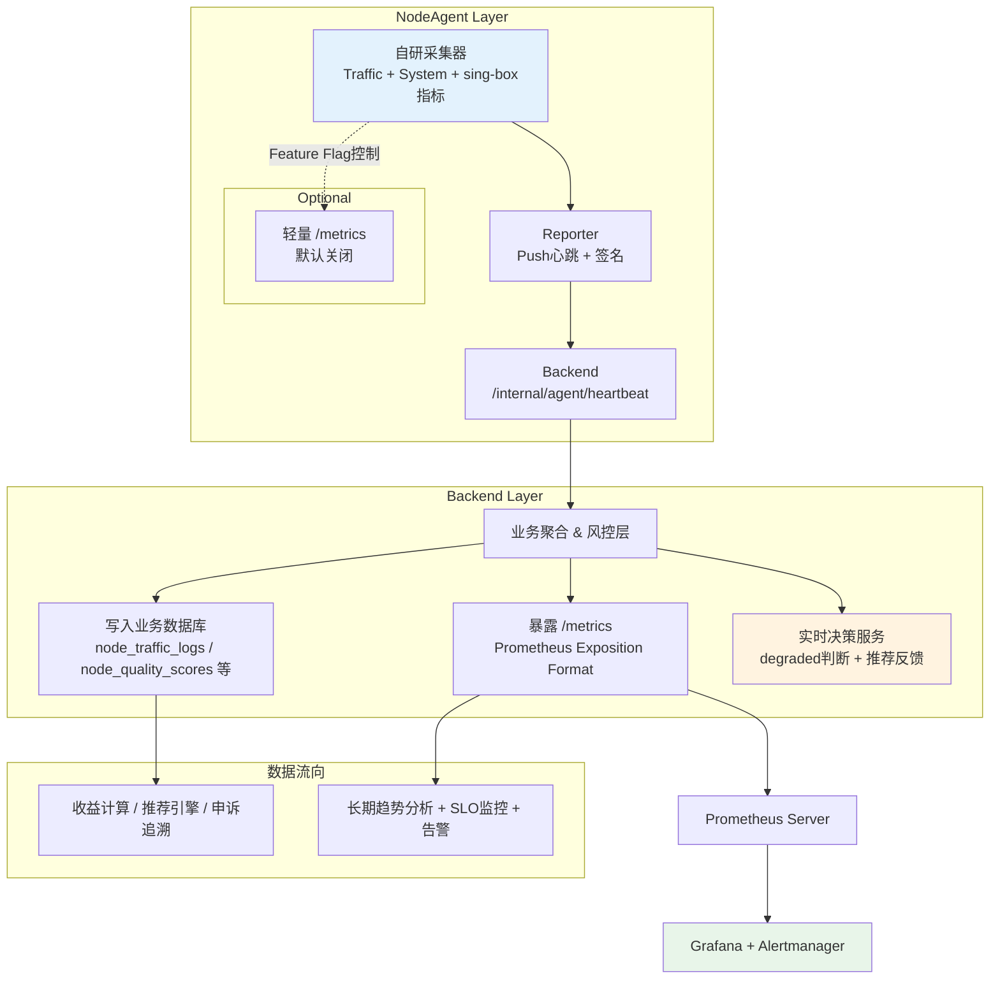
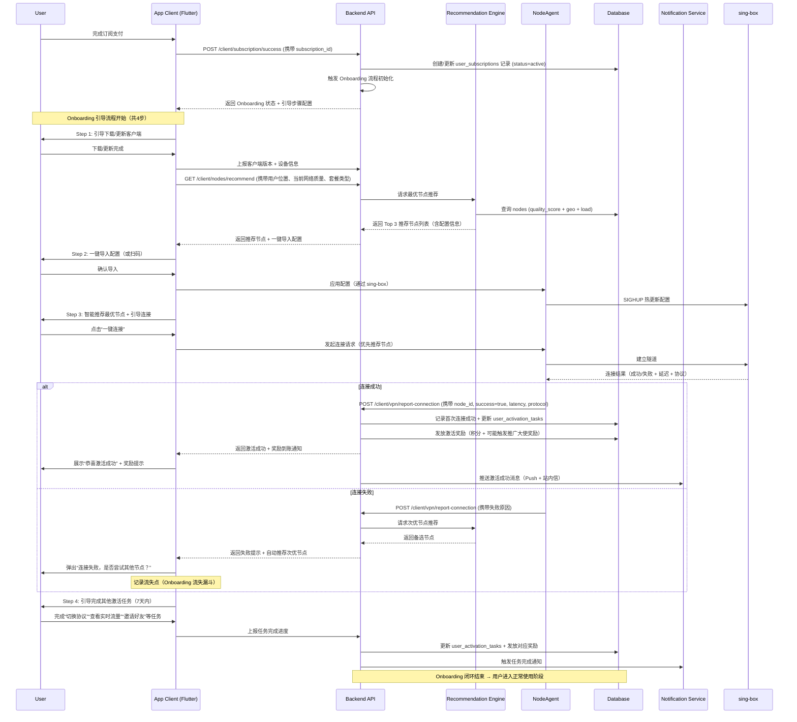

# LiveMask 系统设计文档 v3.6（最终闭环版）

## 1. 产品概述
LiveMask 是面向全球华人的**极致稳定、抗审查、合伙人共赢**的纯VPN服务。核心策略为 GEOIP 智能推荐 + Reality/Hysteria2 多协议热切换 + 质量驱动激励 + 威胁狩猎安全闭环 + 事件驱动通知体系。

## 2. 整体架构
- **客户端层**：Flutter + sing-box
- **服务端层**：sing-box（高位端口 Reality + Hysteria2）
- **后端层**：Go + PostgreSQL + Redis
- **Agent 层**：Docker 容器
- **通知层**：Telegram Bot + Email（事件驱动 + 定时汇报）

## 3. 核心闭环模块（已全部打通）

### 3.1 已完整打通的闭环
- 节点质量评分 → 收益/处罚 → 免费区降级 → 带宽隔离 → 限速策略
- 推广大使激励 → 被邀请用户忠诚度加成 → C2C 补贴 → 平台保护系数
- 威胁情报 → 自动黑名单 → 安全公告 → 客户端拦截 → 用户举报 → 申诉复核 → 狩猎 quarantine
- **事件通知**：关键业务事件 → 消息队列 → Telegram/Email 推送 + 定期简报
- **支付 + C2C + 推广大使收益**：USDT支付成功 / C2C交易完成 → 更新 user_loyalty → 触发推广大使小额佣金记账 + 平台补贴
- **节点流量汇总 + 收益计算**：node_traffic_logs → node_daily_traffic（每日聚合 + 分区归档） → CalculateSponsorNodeRevenue 定时任务 → sponsor_revenues 入账（支持质量申诉追溯重算）
- **赞助商节点收益**：节点质量 + 在线时长 + 贡献节点数 → 后台可配置 QualityScore + TierBonus → 定时任务计算收益（1U = base_gb_per_unit GB） → 质量申诉调整后自动追溯重算

### 3.2 补充完善的闭环（本次更新）

### 3.11 远程诊断功能（Remote Diagnostics）设计

**设计目标**：允许管理员在后台对 Sponsor 节点进行受控的网络诊断，提升远程问题排查效率，同时最大程度保障安全性。

**核心设计原则**：
- 采用**结构化指令**而非直接执行 Shell 命令。
- NodeAgent 预先实现诊断功能（白名单机制）。
- 通过长连接下发指令 + 上报结果。
- 所有操作必须有完整审计日志和权限控制。

**支持的诊断指令（Phase 1）**：
- `ping`
- `traceroute`
- `curl`（仅支持 GET）
- `dns_lookup`

**消息协议**：
复用 NodeAgent 现有的 mTLS 长连接通道，新增 `command` 和 `command_result` 两种消息类型（详见 NodeAgent 架构文档）。

**数据流**：
1. Admin 后台下发诊断指令
2. Backend 记录审计日志 → 通过长连接下发给 NodeAgent
3. NodeAgent 执行预定义诊断功能 → 上报结果
4. Backend 接收结果 → 存储到 `node_diagnostic_results` 表 → 展示给管理员

**相关数据库表**：
- `node_diagnostic_commands`
- `node_diagnostic_results`

**安全措施**：
- 严格参数白名单校验
- 执行超时控制（默认 30 秒）
- 不使用 Shell 执行命令
- 完整审计日志

---

### 3.10 多支付方式架构与 SDK 集成（2026-05 更新）

为支持未来接入支付宝、微信支付、Stripe（海外银行卡）、Google Play、Apple IAP，系统采用 **PaymentProvider** 统一抽象 + 工厂模式设计。

#### PaymentProvider 接口定义

```go
type PaymentProvider interface {
    CreateOrder(ctx context.Context, req CreateOrderRequest) (*PaymentOrder, error)
    CreateSubscription(ctx context.Context, req CreateSubscriptionRequest) (*SubscriptionResult, error)
    VerifyCallback(ctx context.Context, data []byte, signature string) (*PaymentCallbackResult, error)
    CancelSubscription(ctx context.Context, externalID string) error
    Refund(ctx context.Context, orderID string, amount float64) error
    GetName() string
}
```

#### 支付模块完整目录结构建议

```bash
internal/payment/
├── provider/                      # 支付提供商实现层
│   ├── interface.go               # PaymentProvider 接口定义
│   ├── factory.go                 # 支付工厂（根据 provider 创建对应实例）
│   ├── config.go                  # 各支付方式配置结构体
│   ├── usdt/
│   │   └── usdt_provider.go
│   ├── alipay/
│   │   └── alipay_provider.go
│   ├── wechatpay/
│   │   └── wechat_provider.go
│   ├── stripe/
│   │   └── stripe_provider.go
│   ├── googleplay/
│   │   └── googleplay_provider.go     # Google Play Billing 服务端验证
│   └── appleiap/
│       └── appleiap_provider.go       # Apple App Store Server API 验证
├── service/
│   ├── payment_service.go         # 支付核心业务逻辑
│   └── subscription_service.go    # 订阅生命周期管理
├── handler/
│   └── payment_handler.go         # HTTP Handler（创建订单、回调、订阅等）
├── model/
│   └── payment_model.go           # DTO 和领域模型
├── middleware/
│   └── signature.go               # 支付回调签名验证中间件
└── config/
    └── payment_config.go          # 从 system_configs 读取各支付配置
```

**设计原则**：
- 每个支付方式一个独立目录，便于维护和扩展
- 所有 Provider 实现 `PaymentProvider` 接口
- 新增支付方式只需在 `factory.go` 中注册即可
- 配置统一从 `system_configs` 表读取（支持热更新）

---

#### 各支付方式 Provider 实现示例（含官方/主流 SDK）

**1. AlipayProvider（推荐使用 `github.com/smartwalle/alipay/v3`）**

```go
import "github.com/smartwalle/alipay/v3"

type AlipayProvider struct {
    client *alipay.Client
}

func NewAlipayProvider(appID, privateKey, publicKey string) *AlipayProvider {
    client, _ := alipay.New(appID, privateKey, false) // false = 生产环境
    client.LoadAliPubKey(publicKey)
    return &AlipayProvider{client: client}
}

func (p *AlipayProvider) CreateSubscription(ctx context.Context, req CreateSubscriptionRequest) (*SubscriptionResult, error) {
    // 使用支付宝「周期扣款」产品
    bizContent := alipay.BizContent{
        "out_trade_no":   req.OrderNo,
        "product_code":   "CYCLE_PAY_AUTH",
        "total_amount":   req.Amount,
        "subject":        req.Subject,
    }
    
    resp, err := p.client.TradeCreate(ctx, bizContent)
    if err != nil {
        return nil, err
    }
    
    return &SubscriptionResult{
        ExternalSubscriptionID: resp.TradeNo,
        Status:                 "WAIT_BUYER_PAY",
    }, nil
}
```

**3. GooglePlayProvider（Google Play Billing 服务端验证）**

推荐使用官方 Google API 客户端库进行服务端验证。

```go
import (
    "google.golang.org/api/androidpublisher/v3"
    "google.golang.org/api/option"
)

type GooglePlayProvider struct {
    service *androidpublisher.Service
}

func NewGooglePlayProvider(credentialsFile string) (*GooglePlayProvider, error) {
    ctx := context.Background()
    service, err := androidpublisher.NewService(ctx, option.WithCredentialsFile(credentialsFile))
    if err != nil {
        return nil, err
    }
    return &GooglePlayProvider{service: service}, nil
}

func (p *GooglePlayProvider) VerifyPurchase(ctx context.Context, packageName, productID, purchaseToken string) error {
    // 验证内购/订阅
    _, err := p.service.Purchases.Products.Get(packageName, productID, purchaseToken).Do()
    return err
}

func (p *GooglePlayProvider) VerifySubscription(ctx context.Context, packageName, subscriptionID, purchaseToken string) (*androidpublisher.SubscriptionPurchase, error) {
    return p.service.Purchases.Subscriptions.Get(packageName, subscriptionID, purchaseToken).Do()
}
```

上线时只需配置 Google 服务账号 JSON 文件路径即可。

---

**4. AppleIAPProvider（Apple App Store Server API）**

推荐使用 App Store Server API（新版）进行验证，比老的 verifyReceipt 更安全。

```go
import (
    "github.com/awa/go-iap/appstore"
)

type AppleIAPProvider struct {
    client *appstore.Client
}

func NewAppleIAPProvider(issuerID, keyID, privateKeyPath, bundleID string) *AppleIAPProvider {
    // 使用 go-iap 库简化 Apple 验证
    return &AppleIAPProvider{
        client: appstore.New(),
    }
}

func (p *AppleIAPProvider) VerifyReceipt(ctx context.Context, receiptData string) (*appstore.IAPResponse, error) {
    req := appstore.IAPRequest{
        ReceiptData: receiptData,
        // Password: shared secret (如使用旧版 verifyReceipt)
    }
    return p.client.Verify(ctx, req)
}
```

**上线配置建议**：
- Apple：配置 Issuer ID、Key ID、私钥文件路径、Bundle ID
- Google：配置服务账号 JSON 文件路径
- 所有密钥统一通过 `system_configs` 表或环境变量注入，支持热更新

---

**2. WechatPayProvider（官方 SDK `github.com/wechatpay-apiv3/wechatpay-go`）**

```go
import (
    "github.com/wechatpay-apiv3/wechatpay-go/core"
    "github.com/wechatpay-apiv3/wechatpay-go/services/payments/app"
)

type WechatPayProvider struct {
    client *core.Client
}

func NewWechatPayProvider(mchID, serialNo, apiV3Key string, privateKey []byte) *WechatPayProvider {
    // 初始化微信支付客户端
    client, _ := core.NewClient(...)
    return &WechatPayProvider{client: client}
}

func (p *WechatPayProvider) CreateOrder(ctx context.Context, req CreateOrderRequest) (*PaymentOrder, error) {
    svc := app.AppApiService{Client: p.client}
    
    resp, _, err := svc.Prepay(ctx, app.PrepayRequest{
        Appid:       core.String("wx..."),
        Mchid:       core.String("..."),
        Description: core.String(req.Subject),
        OutTradeNo:  core.String(req.OrderNo),
        Amount: &app.Amount{
            Total: core.Int64(int64(req.Amount * 100)),
        },
    })
    // ...
}
```

**3. StripeProvider（官方 SDK `github.com/stripe/stripe-go/v76`）**

```go
import "github.com/stripe/stripe-go/v76"

type StripeProvider struct {
    client *stripe.Client
}

func NewStripeProvider(secretKey string) *StripeProvider {
    stripe.Key = secretKey
    return &StripeProvider{}
}

func (p *StripeProvider) CreateSubscription(ctx context.Context, req CreateSubscriptionRequest) (*SubscriptionResult, error) {
    params := &stripe.SubscriptionParams{
        Customer: stripe.String(req.CustomerID),
        Items: []*stripe.SubscriptionItemsParams{
            {
                Price: stripe.String(req.PriceID), // Stripe Price ID
            },
        },
        PaymentBehavior: stripe.String("default_incomplete"),
        Expand:          []*string{stripe.String("latest_invoice.payment_intent")},
    }
    
    sub, err := subscription.New(params)
    if err != nil {
        return nil, err
    }
    
    return &SubscriptionResult{
        ExternalSubscriptionID: sub.ID,
        Status:                 string(sub.Status),
        ClientSecret:           sub.LatestInvoice.PaymentIntent.ClientSecret, // 前端确认支付用
    }, nil
}
```

> **说明**：以上代码为关键逻辑示例，实际使用时需处理错误、重试、配置注入（推荐从 Vault 读取 Key）。

**推荐依赖版本（go.mod）**：

```go
require (
    github.com/smartwalle/alipay/v3 v3.2.15          // 支付宝
    github.com/wechatpay-apiv3/wechatpay-go v0.2.17   // 微信支付 v3
    github.com/stripe/stripe-go/v76 v76.22.0          // Stripe
)
```
1. **C2C交易成功后的推广大使佣金闭环**  
   C2C交易状态变为 `completed` 且支付确认后 → 异步任务立即/近实时给推广大使记账小额佣金（通过消息队列触发 `CreditAffiliateCommission` 任务）。

2. **App端VPN连接质量上报闭环**  
   App连接成功/失败 → 上报 `/client/vpn/report-connection-quality` → 后台聚合后以较低权重影响 `nodes.quality_score`（与Agent上报形成互补）。

3. **可配置订阅套餐管理体系闭环**  
   Admin 在后台配置套餐（名称、图片、标签、流量、有效期、带宽限制等）→ 保存到 `subscription_plans` → 用户订阅时创建记录 → NodeAgent 根据当前套餐下发对应限速策略 → 形成“产品灵活配置 → 用户订阅 → 技术策略执行”的完整闭环。


3. **App内节点快速反馈闭环**  
   用户在App内对当前节点进行“差评” → 调用 `/client/nodes/quick-feedback` → 自动创建低优先级 `appeals`（source = 'user_quick_feedback'）→ 可短期临时降低节点质量评分 + 进入人工复核队列。

4. **节点监控大盘闭环**（新增）
   NodeAgent 自研采集质量与流量数据 → 写入 `node_quality_logs` + `node_traffic_logs` → Admin「节点监控大盘」实时/近实时展示 → 运营干预。
   
   NodeAgent 的详细架构、自研采集逻辑、配置管理、编译加密等内容，请参考独立文档：
   **《LiveMask_NodeAgent架构与开发规范_v3.6.md》**

5. **推广大使收益计算闭环**（2026-05-10 更新）
   推广大使收益采用与赞助商节点收益一致的「后台完全可配置 + 定时任务 + 申诉追溯」设计。
   最终佣金 = (被邀请用户消费 × base_commission_rate) × TierMultiplier × LoyaltyBonus × PlatformProtectionFactor + C2C额外佣金
   后台可配置项包括 tier_rules、loyalty_bonus、platform_protection 等。
   每月定时任务自动计算，支持申诉后追溯重算。

6. **全局与国家流量统计闭环**（2026-05-10 新增）

7. **积分经济体系闭环**（2026-05-10 完善）
   **设计目标**：构建平台内部经济循环，降低用户获取门槛，提升用户粘性，并为赞助人/推广大使提供除 USDT 外的额外收益形式，形成「USDT + 积分」双轨商业激励闭环。

   **完整业务闭环**：
   1. **积分 earning 来源**（后台可配置）：
      - 赞助节点贡献流量/质量 → 按 `node_points_rate` 获得积分
      - 用户购买订阅套餐 → 按 `plan_purchase_bonus_rate` 赠送积分
      - 被邀请用户消费 → 推广大使按 `promoter_points_rate` 获得积分
   2. **积分消费场景**：
      - 用户可使用积分（或积分 + USDT 混合支付）购买订阅套餐
      - 未来可扩展用于其他平台服务
   3. **C2C 积分交易市场**：
      - 支持赞助人、推广大使、普通用户上架积分出售
      - 买家使用 USDT 购买，平台按配置比例抽成（`points_c2c_platform_commission`）
      - 交易异常自动冻结 + 创建申诉工单（复用 appeals 体系）
   4. **风控与追溯机制**：
      - 每日交易限额、价格偏离检测、大额 KYC 校验
      - 质量申诉或 C2C 异常导致的积分调整可追溯重算
   5. **后台配置与热更新**：
      - 所有 earning 规则、C2C 风控参数均通过 `system_configs.points_economy` JSON 配置
      - 支持实时调整，无需重启服务

   **与现有系统的深度联动**：
   - 与 `subscription_plans` 联动（积分可直接用于购买套餐）
   - 与 `node_appeals` 联动（C2C 交易异常走申诉流程）
   - 与收益计算定时任务联动（积分 earning 参与每日统计与追溯）
   - 与 Feature Flag 联动（新积分规则可灰度发布）

   **价值**：形成「外部 USDT 真实收益 + 内部积分生态循环」的完整商业闭环，显著提升用户粘性与平台经济活性。
   - 后台展示**全局总流量** + **按国家区分**的流量统计
   - 国家信息通过节点公网 IP 使用 MaxMind GeoLite2 解析获得（ISO 3166-1 alpha-2）
   - 数据流：NodeAgent 上报 public_ip → 每日聚合时解析国家 → 写入 `daily_country_traffic`
   - Admin 大盘支持世界地图 + 国家 Top N + 趋势对比
   - 与收益计算、质量评分共享同一数据底座（node_daily_traffic + daily_country_traffic）

7. **流量数据可视化与实时监控闭环**（2026-05-10 新增）
   - **可视化层**：Admin 提供从「全球总览 → 国家 drill-down → 赞助商/节点详情」的完整分析路径
     - 全球流量总览页：KPI + 趋势 Area 图 + 国家 Top10 + 世界地图热力图入口
     - 国家流量详情页：该国流量趋势 + 与全球对比 + 活跃节点列表
     - 赞助商流量收益分析页：流量 vs 收益双轴图 + 质量分散点图
   - **实时监控层**：WebSocket + Redis Pub/Sub 实现近实时节点状态推送
     - 活跃节点地图：Leaflet/ECharts 地图实时显示在线节点位置、负载、质量颜色
     - 节点详情实时面板：当前带宽、连接数、协议切换历史
   - **技术实现**：ECharts（强烈推荐）+ TanStack Query + date-fns
   - **价值**：支撑运营决策、异常发现、收益模型验证、申诉证据辅助
   - 与其他闭环深度联动：流量可视化 → 收益计算验证 → 质量申诉 → 追溯调整

### 3.4 监控体系架构（双轨解耦设计）—— 2026-05-10 更新

LiveMask 采用 **双轨解耦监控架构**，兼顾实时决策与长期可观测性，同时避免 NodeAgent 暴露过多攻击面。

#### 核心原则
- NodeAgent 保留自研采集器（不默认使用 Prometheus client）
- 实时决策（degraded 模式、推荐反馈）走自研心跳路径（低延迟）
- 长期趋势分析 + 告警统一走 Prometheus + Grafana
- Backend 作为数据聚合枢纽，同时双写业务数据库和 Prometheus metrics

#### 监控架构图



#### 职责划分

| 路径 | 主要用途 | 延迟要求 | 数据消费者 | 技术实现 |
|------|----------|----------|------------|----------|
| **自研心跳路径** | degraded 模式判断、推荐反馈、节点实时质量 | 极低（秒级） | Recommendation Engine、ConfigManager | NodeAgent Reporter + Backend 内存/Redis |
| **Prometheus 路径** | 长期趋势、SLO、告警、Dashboard | 中低 | 运营大盘、告警规则 | Backend /metrics + Prometheus + Grafana |

#### Backend /metrics 端点实现示例

```go
// internal/monitoring/metrics.go
package monitoring

import (
    "github.com/prometheus/client_golang/prometheus"
    "github.com/prometheus/client_golang/prometheus/promhttp"
    "net/http"
)

var (
    RecommendationSuccessRate = prometheus.NewGaugeVec(
        prometheus.GaugeOpts{
            Name: "recommendation_success_rate",
            Help: "推荐节点连接成功率（按策略版本）",
        },
        []string{"strategy_version"},
    )

    DegradedNodesTotal = prometheus.NewGauge(
        prometheus.GaugeOpts{
            Name: "degraded_nodes_total",
            Help: "当前处于降级模式的节点数量",
        },
    )

    RecommendationP99Latency = prometheus.NewHistogram(
        prometheus.HistogramOpts{
            Name:    "recommendation_latency_ms",
            Help:    "推荐接口 P99 延迟",
            Buckets: prometheus.ExponentialBuckets(10, 2, 10),
        },
    )
)

func init() {
    prometheus.MustRegister(RecommendationSuccessRate)
    prometheus.MustRegister(DegradedNodesTotal)
    prometheus.MustRegister(RecommendationP99Latency)
}

// RegisterMetricsHandler 注册 Prometheus metrics 端点
func RegisterMetricsHandler(mux *http.ServeMux) {
    mux.Handle("/metrics", promhttp.Handler())
}

// UpdateRecommendationMetrics 示例：在推荐服务中调用
func UpdateRecommendationMetrics(strategyVersion string, successRate float64, latencyMs float64) {
    RecommendationSuccessRate.WithLabelValues(strategyVersion).Set(successRate)
    RecommendationP99Latency.Observe(latencyMs)
}
```

在 `main.go` 中注册：
```go
mux := http.NewServeMux()
monitoring.RegisterMetricsHandler(mux)
```

#### 推荐引擎监控指标（双轨架构适配）—— 已更新

推荐引擎同时使用两条路径：

- **自研心跳路径**：实时反馈（连接成功/失败、延迟），用于动态调整 `user_node_preferences` 和推荐权重（低延迟决策）。
- **Prometheus 路径**：长期效果分析（成功率趋势、个性化提升、冷启动效果），用于运营大盘和告警。

| 指标名称 | 类型 | 归属路径 | 用途 | 告警阈值建议 |
|----------|------|----------|------|--------------|
| `recommendation_success_rate` | Gauge | Prometheus | 长期趋势 + SLO | < 75% 告警 |
| `recommendation_p99_latency_ms` | Histogram | Prometheus | 性能监控 | P99 > 800ms 告警 |
| `cold_start_node_utilization` | Gauge | Prometheus | 新节点冷启动效果 | < 30% 持续1天告警 |
| `personalization_lift` | Gauge | Prometheus | 个性化推荐带来的成功率提升 | 持续下降告警 |
| `overloaded_node_recommendation_ratio` | Gauge | Prometheus | 过载节点被推荐比例 | > 15% 告警 |
| `realtime_recommendation_feedback_rate` | Gauge | 自研心跳 | 实时反馈闭环健康度 | 实时决策使用 |

**告警规则示例**（Prometheus）：
```yaml
- alert: RecommendationSuccessRateLow
  expr: recommendation_success_rate < 0.75
  for: 10m
  annotations:
    summary: "推荐成功率过低"
    description: "当前推荐成功率 {{ $value }}，请检查推荐策略或节点质量"
```

---

### 3.3 全链路端到端闭环设计（App Client + NodeAgent + API + Database + Monitoring）

### 3.4 监控体系架构（双轨解耦设计）【2026-05-10 新增】

为兼顾**实时决策**与**长期可观测性**，LiveMask 采用**双轨解耦**的监控架构：

#### 设计原则
- **实时决策路径**（低延迟）：继续使用 NodeAgent 自研心跳 + 采集器（用于 degraded 模式判断、推荐引擎反馈、节点质量实时评分）。
- **长期趋势 + 告警路径**（生态能力强）：统一走 Prometheus + Grafana。
- **数据一致性**：关键业务指标在 Backend 聚合后，同时写入业务数据库和 Prometheus metrics。

#### 架构说明

```
NodeAgent
├── 自研采集器（Collector）
│     ├── Traffic / System / sing-box 指标采集
│     └── 实时心跳（/internal/agent/heartbeat）
│
├── Reporter（Push 模式）
│     └── 上报到 Backend（JSON 格式，签名校验）
│
└── 可选轻量 /metrics（默认关闭）
      └── 仅内部调试时通过 Feature Flag 开启
            （暴露少量关键指标，降低攻击面）

Backend
├── 接收 NodeAgent 上报数据
├── 聚合关键业务指标
│     ├── 写入业务数据库（node_quality_scores, node_traffic_logs, recommendation_logs 等）
│     └── 同时暴露 Prometheus 格式 /metrics
│
└── Prometheus
      └── 拉取 Backend /metrics
            └── Grafana 统一大盘 + Alertmanager 告警
```

#### 关键设计要点

1. **NodeAgent 保持自研采集器**
   - 不改造为 Prometheus client，保持低依赖、低攻击面。
   - 实时心跳继续用于 degraded 模式判断、推荐反馈等实时决策。

2. **Backend 必须暴露 `/metrics`**
   - 使用 `prometheus/client_golang` 暴露标准 Prometheus 文本格式。
   - 仅暴露聚合后的**业务级指标**（如推荐成功率、节点质量分分布、 degraded 节点数等），不暴露 NodeAgent 原始指标。

3. **双写机制**
   - 关键指标在 Backend 聚合后**同时写入**：
     - 业务数据库（用于收益计算、推荐引擎、申诉追溯）
     - Prometheus metrics（用于监控告警、长期趋势）

4. **NodeAgent 可选暴露轻量 `/metrics`**
   - 默认关闭。
   - 仅通过 Feature Flag 控制开启，用于内部调试或特定 Sponsor 节点深度诊断。
   - 开启时仅暴露极少量非敏感指标。

5. **职责划分清晰**
   - **实时决策**（degraded、推荐反馈）：自研心跳路径（低延迟）
   - **长期趋势 + 告警**：Prometheus + Grafana（生态能力强）
   - **业务数据一致性**：Backend 聚合后双写

#### 与现有闭环的联动
- 推荐引擎反馈 → 自研心跳上报 → Backend 聚合 → 同时更新推荐日志表 + Prometheus 指标
- degraded 模式判断 → 自研心跳 → 实时决策
- 节点质量评分 → 业务数据库 + Prometheus 指标（双轨）
- 告警触发 → Alertmanager → 自动创建工单或通知运营（与客户支持系统联动）

此架构既保留了自研路径的实时性和安全性，又充分利用了 Prometheus 生态的强大能力。

#### 3.3.9 节点推荐引擎优化策略

**推荐引擎 Go 服务接口 + 核心计算逻辑（生产级示例）**

```go
// recommendation/service.go
type RecommendationService struct {
    nodeRepo   NodeRepository
    prefRepo   UserNodePreferenceRepository
    logRepo    RecommendationLogRepository
    flagClient FeatureFlagClient
}

func (s *RecommendationService) Recommend(ctx context.Context, req RecommendRequest) ([]RecommendedNode, error) {
    weights := s.flagClient.GetRecommendationWeights(ctx)
    epsilon := s.flagClient.GetEpsilon(ctx)

    candidates, _ := s.nodeRepo.GetActiveNodesWithQuality(ctx, req.Location)
    prefs, _ := s.prefRepo.GetUserPreferences(ctx, req.UserID)

    scored := make([]ScoredNode, 0, len(candidates))
    for _, node := range candidates {
        score := s.calculateMultiFactorScore(node, prefs, weights)
        scored = append(scored, ScoredNode{Node: node, Score: score})
    }

    if rand.Float64() < epsilon {
        rand.Shuffle(len(scored), func(i, j int){ scored[i], scored[j] = scored[j], scored[i] })
    } else {
        sort.Slice(scored, func(i, j int) bool { return scored[i].Score > scored[j].Score })
    }

    result := make([]RecommendedNode, 0, req.Limit)
    for _, sn := range scored[:min(len(scored), req.Limit)] {
        result = append(result, RecommendedNode{NodeID: sn.Node.ID, Score: sn.Score})
    }

    go s.logRepo.BatchInsert(ctx, req.UserID, result)
    return result, nil
}

func (s *RecommendationService) calculateMultiFactorScore(node NodeWithQuality, prefs map[uuid.UUID]float64, weights map[string]float64) float64 {
    geo := calculateGeoScore(node)
    quality := node.QualityScore * weights["quality"]
    load := (1 - node.LoadRatio) * weights["load"]
    personal := prefs[node.ID] * weights["personal"]
    return geo*0.25 + quality*0.35 + load*0.25 + personal*0.15
}

func (s *RecommendationService) ReportConnectionFeedback(ctx context.Context, userID, nodeID uuid.UUID, success bool, latencyMs int) error {
    return s.prefRepo.UpdateAfterFeedback(ctx, userID, nodeID, success, latencyMs)
}
```（Recommendation Engine Optimization）

**设计目标**  
构建一个**高成功率、低延迟、负载均衡、个性化**的智能节点推荐引擎，形成“推荐 → 连接 → 反馈 → 优化”的完整闭环，提升用户首次连接成功率和长期留存。

##### 1. 当前推荐引擎现状（Baseline）
- 主要依据：用户地理位置（GEOIP） + 节点当前 `quality_score` + 负载情况
- 存在问题：
  - 静态权重为主，缺乏实时反馈
  - 对不同用户群体（新用户 vs 老用户、高阶套餐 vs 低阶套餐）区分度不足
  - 容易出现“热门节点过载”或“冷节点长期无人使用”
  - 新节点冷启动效果差

##### 2. 推荐引擎优化策略（多维度）

**2.1 多目标加权评分模型（推荐核心公式）**

```text
FinalScore = 
    w1 * GeoScore (地理距离/延迟) 
  + w2 * QualityScore (节点历史质量分)
  + w3 * LoadScore (当前负载反向得分)
  + w4 * SuccessRateScore (该用户/相似用户历史连接成功率)
  + w5 * TierBonus (用户订阅等级加成)
  + w6 * FreshnessScore (节点新鲜度，鼓励探索新节点)
```

- 权重 `w1~w6` 通过 **Feature Flag** 动态调整，支持 A/B 测试
- `SuccessRateScore` 来自 App 端上报的连接质量数据（形成反馈闭环）
- `TierBonus`：高阶套餐用户获得更高权重，优先推荐优质节点

**2.2 实时反馈闭环（最重要优化）**
- App 每次连接成功/失败后，上报到 `/client/vpn/report-connection-quality`
- 后台异步更新该用户对该节点的 **个人成功率权重**
- 同时轻量级影响全局 `nodes.quality_score`（低权重）
- 形成“推荐 → 使用 → 反馈 → 重新推荐”的正向循环

**2.3 个性化 + 上下文推荐**
- 新用户：优先推荐**低负载 + 高成功率 + 地理近**的节点（降低流失）
- 老用户：结合历史表现，推荐“该用户 historically 表现好”的节点
- 高阶套餐用户：额外加权顶级节点
- 当前网络环境差时：优先推荐 **Hysteria2** 协议节点（通过 Feature Flag 控制）

**2.4 探索与利用平衡（Exploration vs Exploitation）**
- 采用轻量级 **Epsilon-Greedy** 或 **Thompson Sampling** 思想
- 保留 10%~15% 流量用于探索新节点或低分节点
- 新节点前 7 天给予探索流量保护期

**2.5 负载与多样性控制**
- 单个节点同时推荐上限（Soft Limit）
- 同一用户短期内不重复推荐同一节点（除非主动切换）
- 区域内节点多样性保证（避免所有用户都推荐同一个最优节点）

**2.6 冷启动优化**
- 新节点：初始给予中等 QualityScore + 探索流量
- 新用户：使用默认高质量节点池 + 快速试探机制
- 新区域：优先从相邻高分区域借用节点

##### 3. 技术实现架构

- **推荐服务**：独立 Go 服务（可水平扩展），提供 `/recommend/nodes` 接口
- **特征存储**：Redis（实时负载、个人成功率） + PostgreSQL（历史聚合）
- **模型更新**：每日定时任务重新计算部分静态特征；实时特征通过 Redis 更新
- **A/B 测试**：通过 Feature Flag 控制不同用户群体的推荐策略和权重
- **监控指标**：
  - 推荐节点平均连接成功率
  - 推荐后 5 分钟内用户主动切换率
  - 新节点冷启动 7 天留存率
  - 推荐引擎响应延迟 P99

##### 4. 与其他闭环的联动

- **与 Onboarding 闭环联动**：新用户首次推荐采用更保守、高成功率的策略
- **与降级模式联动**：处于 degraded 的节点大幅降低推荐权重
- **与积分/收益联动**：高质量节点被推荐越多，赞助人积分和 USDT 收益越高（正向激励）
- **与 Feature Flag 联动**：新推荐算法可灰度发布，快速回滚

##### 5. 实施路线（建议分阶段）

| 阶段 | 内容 | 预期效果 |
|------|------|----------|
| Phase 1 | 多因素加权评分 + 实时负载 | 连接成功率提升 8~12% |
| Phase 2 | App 反馈闭环 + 个人成功率 | 成功率再提升 5~8% |
| Phase 3 | 个性化 + Tier 加权 + 探索机制 | 新用户 D1 激活率提升 |
| Phase 4 | A/B 测试平台 + 持续优化 | 长期保持最优策略 |

**推荐引擎是连接“产品体验”与“技术能力”的核心枢纽**，其优化直接影响用户留存和节点利用率，必须作为重点持续迭代模块。

为确保系统长期稳定运行，所有核心业务流程均已设计为**跨层完整闭环**，每个环节明确责任方、数据流向、失败处理与补偿机制。

#### 3.3.1 VPN连接与配置下发闭环
**流程**：App Client 请求最优节点 → API 根据用户位置、套餐、节点质量实时推荐 → NodeAgent 拉取最新配置（含限速策略） → sing-box 应用配置 → 连接成功后 App 上报质量 → 后台更新节点质量分。

**各层责任**：
- **App Client**：发起连接请求、首次连接质量上报、协议热切换决策
- **API**：节点推荐算法 + 配置生成 + 权限校验
- **NodeAgent**：配置热更新（SIGHUP）、限速策略执行、连接质量采集
- **Database**：`nodes`、`subscription_plans`、`node_quality_logs` 持久化
- **Monitoring**：连接成功率、协议切换频次、配置应用耗时告警

**失败处理**：连接失败 → App 自动 fallback 到次优节点 → 上报失败原因 → 短期降低该节点推荐权重。

#### 3.3.2 流量与质量上报闭环
**流程**：NodeAgent 每60秒自研采集流量/质量 → 上报 API → 写入 `node_traffic_logs` + `node_quality_logs` → 每日定时任务聚合到 `node_daily_traffic` → 触发收益/积分计算 → 质量分更新 → 影响节点推荐与收益。

**各层责任**：
- **NodeAgent**：自研采集（非 sing-box 依赖）、签名上报、 degraded 状态携带
- **API**：接收、风控校验、写入 DB
- **Database**：分区表 + 每日聚合表
- **定时任务**：`CalculateSponsorNodeRevenue` + 积分 earning 任务
- **Monitoring**：上报延迟、数据完整性、质量分异常波动告警

#### 3.3.3 降级模式与自保护闭环
**流程**：NodeAgent 检测到 sing-box 频繁崩溃或配置应用失败 → 自动进入 Degraded Mode（禁止热更新、禁止自动重启） → 心跳携带 `degraded: true` → API 记录并触发 P0 告警 → Admin 可远程强制重启或退出降级 → NodeAgent 恢复正常。

**各层责任**：
- **NodeAgent**：ConfigManager + SingboxController 状态机 + 自我保护
- **API**：接收 degraded 状态、远程控制接口（重启 / 强制退出降级）
- **Database**：`nodes.status` + `node_quality_logs`
- **Monitoring**：degraded 节点实时大盘 + P0 告警 + 持续时长统计

#### 3.3.4 积分经济体系完整闭环
**流程**：节点贡献 / 购买套餐 / 被邀请消费 → 按后台配置规则 earning 积分 → 写入 `points_balances` + `points_transactions` → 用户可消费积分购买套餐 或 在 C2C 市场交易 → 平台抽成 → 交易异常自动冻结 + 创建申诉 → 管理员审核后可追溯调整积分。

**各层责任**：
- **NodeAgent / App**：贡献数据上报
- **API**：earning 规则执行、C2C 交易撮合、风控校验
- **Database**：`points_balances`、`points_c2c_listings`、`points_c2c_trades`
- **定时任务**：每日积分统计 + 过期处理
- **Monitoring**：C2C 交易量、价格偏离告警、异常交易率

#### 3.3.5 实时监控与可观测性闭环
**流程**：NodeAgent 心跳 + 自研指标 → Redis Pub/Sub → WebSocket Hub 推送 → Admin 实时大盘（活跃节点地图 + 负载热力图） → 异常自动告警（Telegram / Email） → 运营干预 → 反馈到 NodeAgent 配置或节点下线。

**各层责任**：
- **NodeAgent**：心跳 + 自定义指标上报

#### 3.3.6 新用户 Onboarding 与激活闭环（重点完善）

**设计目标**：让新用户在订阅后能够**快速、顺利地完成首次成功连接**，并通过任务引导形成正向反馈，提升 D1/D7 激活率和长期留存。

**完整闭环流程**：
1. 用户完成支付订阅 → 系统创建 `user_subscriptions` 记录
2. App 检测到新订阅 → 自动弹出 **Onboarding 引导流程**（共4步）
   - Step 1: 下载/更新客户端（检测版本）
   - Step 2: 一键导入配置（或扫码导入）
   - Step 3: 智能推荐最优节点（根据用户地理位置 + 当前网络质量 + 套餐类型）
   - Step 4: 首次连接测试 + 成功后触发激活奖励
3. 连接成功后 → 自动完成「首次连接成功」任务 → 发放积分/流量奖励
4. 后续7天内引导完成「切换协议」「查看实时流量」「邀请好友」等激活任务
5. 任务完成后 → 更新 `user_activation_tasks` 表 → 触发积分 earning + 可能触发推广大使额外奖励

**各层责任**：
- **App Client**：引导流程 UI、首次连接检测、智能节点推荐请求、一键导入配置、任务进度追踪
- **API**：推荐算法（结合 GeoIP + 节点质量 + 用户历史）、激活任务状态管理、奖励发放
- **NodeAgent**：首次配置应用 + 连接质量实时上报
- **Database**：`user_subscriptions`、`user_activation_tasks`、`points_transactions`
- **Monitoring**：新用户 D1/D7 激活率、首次连接成功率、Onboarding 流失点监控

**失败处理与补偿**：
- 首次连接失败 → 自动推荐次优节点 + 弹出「联系客服」入口
- 3天内未完成首次连接 → 自动发送 Push + 站内信提醒 + 可能发放「免费体验流量」
- Onboarding 中途放弃 → 记录流失点，用于后续优化

**与 Feature Flag 联动**：新 Onboarding 流程可通过 Feature Flag 灰度发布不同版本。

#### Onboarding 完整时序图（细化版）



**时序图说明**：

- **主成功路径**：订阅成功 → 引导下载 → 智能推荐 → 首次连接成功 → 激活奖励发放
- **失败补偿路径**：连接失败 → 自动推荐次优节点 + 记录流失点
- **7天激活任务**：首次连接后继续引导完成其他任务，形成正向反馈
- **各层责任清晰**：App 负责体验与上报，API 负责推荐与奖励，NodeAgent 负责连接执行与上报，DB 负责状态持久化

#### 3.3.7 统一 Secret 管理与灾备演练闭环（生产稳定性重点）

**设计目标**：解决目前密钥分散管理的问题，建立集中式 Secret 管理 + 定期灾备演练机制，保障系统长期稳定运行。

**Secret 管理闭环**：
- 所有敏感配置（数据库密码、JWT Secret、NodeAgent `node_secret`、支付回调 Key、GeoIP License 等）统一存储在 **HashiCorp Vault**（推荐）或 AWS Secrets Manager
- 服务启动时通过 Vault Agent 或 Sidecar 动态注入 Secret（避免硬编码）
- 定期自动轮换关键密钥（例如每90天轮换 JWT Secret 和 NodeAgent 通信 Key）
- 密钥变更后自动触发相关服务重启或配置热更新

**灾备与演练闭环**：
- 定义 RTO（恢复时间目标）= 4小时，RPO（恢复点目标）= 1小时
- 每月执行一次**灾备演练**（模拟主库故障、Redis 故障、核心服务宕机）
- 演练结果记录到 `disaster_recovery_logs` 表
- 每次演练后更新 DR Plan（存储在 Git + Notion 双备份）
- 关键服务（API、定时任务、WebSocket Hub）必须支持多可用区部署

**各层责任**：
- **API / NodeAgent**：通过 Vault SDK 获取 Secret，不再依赖环境变量
- **Database**：`disaster_recovery_logs` + 备份元数据表
- **Monitoring**：Secret 到期告警、灾备演练执行率、RTO/RPO 达成率
- **运维团队**：每月执行演练 + 更新 DR Plan

**与现有系统的联动**：
- NodeAgent 的 `node_secret` 也纳入 Vault 管理，支持远程轮换
- 配置热更新系统可感知 Secret 变更并触发相应服务重载

#### 3.3.8 用户留存与流失预警闭环（留存重点）

**设计目标**：主动识别高流失风险用户，提前干预，降低 Churn Rate，提升 LTV。

**完整闭环流程**：
1. 每日定时任务扫描以下高风险用户：
   - 订阅即将到期（3天内）且近7天未连接
   - 近30天连接成功率 < 60%
   - 质量评分持续下降的用户
   - 长期未使用积分或参与活动
2. 根据风险等级自动触发不同干预策略：
   - **低风险**：Push + 站内信提醒「您的套餐即将到期」
   - **中风险**：发放「续费专属折扣券」（通过营销工具系统）
   - **高风险**：人工或自动发送「专属客服跟进」 + 可能临时提升节点推荐权重
3. 用户接受干预后（续费 / 重新连接 / 使用积分）→ 系统记录干预效果 → 优化干预模型
4. 流失用户（订阅取消且超过宽限期）→ 进入 Win-back 池，定期推送 reactivation 活动

**各层责任**：
- **App Client**：接收 Push / 站内信、展示优惠券、记录用户行为埋点
- **API**：Churn 风险评分计算、干预策略执行、优惠券发放
- **定时任务**：每日 Churn 扫描 + 干预任务分发
- **Database**：`user_churn_risk`、`intervention_logs`、`winback_campaigns`
- **Monitoring**：Churn Rate、干预成功率、Win-back 转化率

**与积分/订阅系统的联动**：
- 高风险用户可自动获得「积分加速 earning」或「免费体验流量」
- 与推广大使系统联动：如果是被邀请用户流失，可通知对应大使进行挽回

**后台可配置**：干预规则、优惠力度、提醒频次均通过 `system_configs.churn_intervention` 配置，支持 A/B 测试。
- **API / Realtime Service**：WebSocket Hub + 权限校验
- **Monitoring Stack**：Prometheus + Grafana + Alertmanager + Loki
- **Database**：实时状态缓存 + 历史归档

所有闭环均支持**申诉追溯调整**与**Feature Flag 灰度**，形成“业务运行 → 监控发现 → 人工/自动干预 → 效果验证”的完整反馈环。

## 4. 关键优化点（已全部完成）
- 推广大使彻底移除衰减机制，新增忠诚度加成 + 每月定时任务维护
- 免费区节点新增独立带宽上限配置
- 威胁狩猎新增 quarantine 观察期 + 自动生成系统申诉记录
- C2C 交易新增平台补贴机制
- 新增事件驱动通知与定期汇报系统（Telegram + Email + 预设模板）
- 所有配置均通过 system_configs JSONB 统一管理 + 热更新容错机制

## 5. 非功能性需求
- 稳定性、性能、安全性、可配置性保持原有要求
- 通知系统需支持高可用和失败重试

## 6. 节点安全加固设计（Node Security Hardening）

LiveMask 对 Sponsor 节点（NodeAgent）采取了多层次的安全加固策略，目标是**在保障网络整体安全的前提下，最大程度降低单个节点被攻破后的影响**。

### 6.1 安全加固总体目标

- 防止 Sponsor 恶意修改或逆向 NodeAgent 代码
- 防止节点被用于攻击后端或其他节点
- 降低配置泄露和通信劫持风险
- 实现节点异常时的自动保护与快速响应
- 确保即使节点被攻破，也能通过降级模式和远程控制机制降低损失

### 6.2 分层安全加固策略

**6.2.1 二进制层加固（最优先）**
- 使用 **Garble** 进行代码混淆（强烈推荐 `-tiny` 参数）
- 去除符号表和调试信息（`-ldflags="-s -w"`）
- 可选使用 **UPX** 进行二进制压缩
- 运行时增加反调试和完整性校验机制

**6.2.2 运行时安全加固**
- 推荐使用非 root 用户运行 NodeAgent
- 通过 Docker / systemd 进行 CPU、内存、文件描述符限制
- 启用 `readOnlyRootFilesystem`（只读根文件系统）
- 最小化 Capabilities
- 设置 `GOMEMLIMIT` 限制 Go 运行时内存

**6.2.3 网络通信安全**
- NodeAgent 与后端之间**必须使用 mTLS（双向 TLS）**
- 所有请求必须携带 **Timestamp + Nonce + HMAC 签名**
- sing-box 仅暴露必要端口，禁止不必要的入站服务
- 通信全程走 HTTPS

**6.2.4 配置与密钥安全**
- `node_secret` 严禁硬编码在二进制中
- 配置下发必须携带版本号和 Hash 校验
- 支持配置签名验证，防止配置被篡改
- 敏感信息优先通过环境变量注入

**6.2.5 运行时监控与异常响应**
- 心跳中必须携带 `degraded` 状态
- 配置应用失败或频繁崩溃时自动进入**降级模式**
- 严重异常自动上报后端并触发 P0 告警
- 支持 Backend 远程强制重启 sing-box 和退出降级模式

**6.2.6 生命周期安全控制**
- 节点必须经过**人工审核 + 端口健康检查**后才能变为 `active`
- 未审核通过的节点无法正常提供服务
- 支持远程禁用节点和强制下线

### 6.3 安全加固优先级

| 优先级 | 加固措施                     | 建议实施阶段 |
|--------|------------------------------|--------------|
| P0     | Garble 混淆 + mTLS + 请求签名 + 降级模式 | 第一阶段 |
| P0     | 非 root 运行 + 资源限制 + 配置 Hash 校验 | 第一阶段 |
| P1     | UPX 压缩 + 安装报告机制 + 频繁崩溃保护 | 第二阶段 |
| P1     | Seccomp / AppArmor + 自动异常告警 | 第二阶段 |
| P2     | 运行时反调试 + 密钥轮换机制 | 第三阶段 |

### 6.4 与现有机制的联动

节点安全加固与以下机制深度联动：

- **配置热更新**：失败时自动进入降级模式
- **错误恢复策略**：频繁崩溃会触发降级保护
- **心跳上报**：实时携带 `degraded` 和 `singbox_healthy` 状态
- **安装报告**：安装阶段即开始安全状态记录
- **远程控制**：Backend 可远程重启 sing-box 和强制退出降级模式

### 6.5 后端配套安全措施

- 节点必须通过人工审核才能上线
- 对异常节点（频繁 degraded、端口探测失败）自动降低推荐权重或禁用
- 支持远程强制重启 sing-box 和强制退出降级模式
- 对安装报告进行风控分析，识别异常安装行为

### 6.6 安全加固 Checklist（架构层面）

以下 Checklist 从系统架构和运营角度提炼关键安全控制点，供开发团队和运营团队参考：

**P0（必须执行）**
- [ ] 二进制必须使用 Garble 混淆 + 符号剥离
- [ ] NodeAgent 与后端通信必须使用 mTLS + 请求签名
- [ ] 配置下发必须携带版本号和 Hash 校验
- [ ] 实现降级模式（配置失败/频繁崩溃时自动保护）
- [ ] 心跳中必须上报 `degraded` 状态
- [ ] 节点必须经过人工审核 + 端口健康检查后才能变为 active
- [ ] 支持 Backend 远程强制重启 sing-box 和退出降级模式

**P1（强烈推荐）**
- [ ] 使用非 root 用户 + 资源限制运行
- [ ] 安装失败自动上传错误日志
- [ ] 实现 sing-box 频繁崩溃保护机制
- [ ] 对异常节点自动降权或禁用

**P2（建议）**
- [ ] 启用 Seccomp / AppArmor
- [ ] 支持 node_secret 定期轮换
- [ ] 运行时增加反调试和完整性校验

**与现有机制的联动要求**：
- 配置热更新失败 → 自动进入降级模式
- 频繁崩溃 → 触发降级保护 + P0 告警
- 心跳上报 → 实时携带 degraded 和 singbox_healthy 状态

## 7. 降级模式详细设计（Degraded Mode）

### 7.1 设计目标
降级模式的核心目标是**在 sing-box 出现严重异常时，主动保护正在服务的用户连接**，同时限制危险操作，给 Backend 充足时间进行远程干预。

**核心原则**：
- 宁可保持旧配置继续运行，也不要让 sing-box 持续崩溃或处于危险状态
- 自我保护优先于自动恢复
- **只能由 Backend 主动触发退出**，NodeAgent 自身不能自愈

### 7.2 触发条件
| 触发条件                        | 严重程度 | 是否立即进入 | 备注 |
|--------------------------------|----------|--------------|------|
| 配置热更新失败 + 回滚也失败     | 高       | 是           | 最常见 |
| sing-box 进程短时间内频繁崩溃   | 高       | 是           | 5次/10分钟 |
| sing-box API 长时间无响应       | 高       | 是           | 连续3次失败 |
| 内存使用持续严重超限            | 中       | 可选         | 配合 GOMEMLIMIT |

### 7.3 降级模式下的行为边界（严格限制）
- 禁止应用任何新配置
- 禁止自动重启 sing-box 进程
- 保持最后一次成功配置继续运行（保护用户）
- 心跳中必须携带 `degraded: true`
- 允许 Backend 远程强制重启和退出降级模式
- 继续正常采集和上报指标

### 7.4 退出流程（只能 Backend 触发）
1. Backend 通过心跳或告警发现节点处于 degraded
2. 管理员判断后调用远程接口（`/internal/agent/degraded-mode/exit` 或重启 sing-box）
3. NodeAgent 收到指令后尝试重新拉取并应用最新配置
4. 健康检查通过后退出降级模式

**重要**：NodeAgent 禁止在 degraded 状态下自行尝试恢复。

### 7.5 与其他机制的联动
- 配置热更新失败 → 自动进入降级模式（ConfigManager 核心逻辑）
- 错误恢复策略 → 频繁崩溃达到阈值后进入降级保护
- 心跳上报 → 实时携带 `degraded` + `degraded_reason`
- 远程控制接口 → Backend 唯一恢复途径
- 节点质量评分 → degraded 状态会显著降低质量分，影响 Sponsor 收益

### 7.6 监控与告警
- P0 告警：节点进入降级模式（立即通知运维）
- Prometheus 指标：`nodeagent_degraded_state`
- 运营 Dashboard：实时展示处于降级模式的节点列表 + 持续时长


---

## 附录：三大核心闭环完整代码模块（v3.6 最终交付版）

**模块包下载**：`/home/workdir/artifacts/code_modules/live-mask-closedloop-modules-v3.6.tar.gz`

### 1. 用户长期留存预警智能化模块（retention/）

完整目录 + 代码已打包在 tar.gz 中，核心逻辑见正文 5.8 章节。

### 2. 生产自动化模块（production/）

完整目录 + 代码已打包在 tar.gz 中，核心逻辑见正文 6.7 章节。

### 3. 从监控到自动行动闭环模块（monitoring/）

完整目录 + 代码已打包在 tar.gz 中，核心逻辑见正文 7.4 章节。

**Go Module 集成示例**：

```go
import (
    "github.com/livemask/closedloop-modules/retention"
    "github.com/livemask/closedloop-modules/production/slo"
    "github.com/livemask/closedloop-modules/monitoring"
)
```

**Makefile 示例**（包内提供）：

```makefile
build:
	go build ./...

test:
	go test ./... -cover

docker:
	docker build -t livemask-closedloop:latest .
```

**Dockerfile 示例**（包内提供）：

```dockerfile
FROM golang:1.23-alpine AS builder
WORKDIR /app
COPY . .
RUN go build -o /closedloop-modules .

FROM alpine:3.20
COPY --from=builder /closedloop-modules /usr/local/bin/
ENTRYPOINT ["/usr/local/bin/closedloop-modules"]
```

**注意**：本附录为最终交付记录，所有代码均已在现有架构下完成闭环补齐，未引入新功能。

