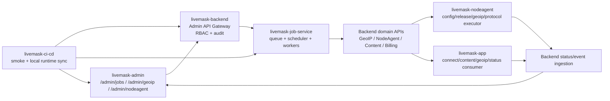

# App / NodeAgent / Job Service / Backend / Admin Closed Loop Architecture

> Task: `TASK-DOC-CONTROL-PLANE-001`
> Owner: Product / Docs / Backend / Job Service / NodeAgent / App / Admin / CI-CD
> Status: Ready
> Scope: Defines the long-term LiveMask control-plane loop across Admin,
> Backend, Job Service, NodeAgent, and App.

Related mandatory contract:

- [Job Queue Usage Matrix](../../contracts/jobs/JOB_QUEUE_USAGE_MATRIX.md) — global
  decision matrix for queue-required, queue-recommended, synchronous, and
  outbox-required workflows. Backend and NodeAgent tasks must check it before
  implementing new long-running or fan-out behavior.

## 1. Why This Exists

LiveMask is moving from simple API CRUD into an operational network platform.
The platform will manage:

- NodeAgent binary rollout and rollback
- NodeAgent runtime config publish and rollback
- GeoIP database source update and artifact distribution
- VPN protocol profile rollout
- Node endpoint health/probe checks
- App content feed and scheduled announcements
- App local GeoIP sync and node region display
- Dashboard traffic aggregation
- Billing/session cleanup and reconciliation

These workflows cannot be designed as separate buttons or isolated APIs. They
must form one closed loop:

```text
Admin decides / schedules
  -> Backend authenticates, authorizes, audits, and validates domain boundaries
  -> Job Service queues, fans out, retries, rate-limits, and records events
  -> Backend domain APIs / NodeAgent / App consume changes safely
  -> NodeAgent and App report status/events
  -> Backend aggregates truth
  -> Admin shows progress, failures, rollback, and audit
  -> CI/CD verifies the loop
```

## 2. North Star

The target architecture is a **control plane** with clear ownership:

| Component | Primary Role | Must Not Do |
| --- | --- | --- |
| Admin | Human operations surface | Execute long-running work directly |
| Backend | Auth/RBAC, domain state, public/internal API gateway, audit | Run batch fan-out work inside request handlers |
| Job Service | Queue, schedule, retry, backoff, leases, worker pool, run events | Own user-facing RBAC or bypass domain validation |
| NodeAgent | Node-side executor, health reporter, local LKG/rollback | Trust unsigned config/artifacts or hide degraded state |
| App | User-facing state, local cache, safe degraded display, event report | Receive secrets or depend on Admin-only APIs |
| CI/CD | End-to-end verification and runtime sync | Mutate local dev runtime destructively |

## 3. Canonical Runtime Topology



## 4. Control Plane Principles

1. **Admin creates intent, not work.**
   Admin submits “roll out release”, “update GeoIP”, “publish config”, or “run
   probe” intent. It never loops over nodes or downloads artifacts itself.

2. **Backend validates and records authority.**
   Backend owns Admin JWT, RBAC, owner-domain permission checks, audit identity,
   and domain state validation.

3. **Job Service executes asynchronously.**
   All long-running work goes through queue, lease, worker pool, retry, backoff,
   idempotency, and per-target locks.

4. **NodeAgent and App are pull-safe clients.**
   They fetch signed/verified config or artifacts, keep last-known-good state,
   and report events. They never receive vendor credentials or Admin secrets.

5. **Backend aggregates truth.**
   Backend stores canonical node/app/job/domain status. Admin views Backend
   state, not raw worker assumptions.

6. **Every loop has rollback.**
   If a rollout, config, GeoIP, content, or protocol job can change runtime
   behavior, it must define rollback and validation before it is implemented.

## 5. Closed Loops

### 5.1 NodeAgent Binary Rollout

```text
Admin selects release + target cohort
  -> Backend checks nodeagent:write + jobs:execute
  -> Job Service creates rollout run and per-node queue items
  -> Worker waves nodes by region/cohort/concurrency limit
  -> Backend exposes release assignment/version check
  -> NodeAgent downloads artifact, verifies sha256/signature, installs, restarts safely
  -> NodeAgent reports upgrade event + health
  -> Backend aggregates rollout progress
  -> Admin shows wave progress and can pause/rollback
```

Required safeguards:

- Per-node lock: `node_id`
- Wave limit: count and percentage
- Error threshold stop
- LKG binary rollback on node
- Release artifact signature/sha256 verification
- Job events per node
- Backend audit for run/pause/rollback

### 5.2 NodeAgent Runtime Config Publish

```text
Admin edits config or selects rollback
  -> Backend validates schema/version/compatibility
  -> Job Service queues target assignments
  -> Backend publishes config version and target scope
  -> NodeAgent pulls config, validates, applies hot reload
  -> NodeAgent reports config_hash/config_version/degraded status
  -> Backend aggregates assignment health
  -> Admin shows success/failure and rollback button
```

Required safeguards:

- Schema version gate
- Unknown field behavior
- Last-known-good config
- Redacted errors
- No secrets in status or job events
- Per-target idempotency key

### 5.3 GeoIP Database Update And Distribution

```text
Admin configures source credentials
  -> Admin runs/schedules geoip_source_update through Job Center
  -> Backend validates geoip:write + jobs:execute
  -> Job Service downloads source using Backend credential boundary
  -> Artifact normalized, hashed, stored, signed
  -> Backend exposes NodeAgent/App manifests
  -> NodeAgent syncs verified full/delta package with LKG
  -> App syncs verified full/delta package with local cache
  -> NodeAgent/App report events
  -> Admin shows source/update/package rollout status
```

Required safeguards:

- Source allowlist
- Credential redaction
- Artifact signature
- Unknown format rejection
- Full fallback when delta fails
- NodeAgent/App LKG rollback
- App never accesses third-party GeoIP sources

### 5.4 Protocol Profile Rollout

```text
Admin configures endpoint/profile metadata
  -> Backend validates profile_config safe fields and secrets boundary
  -> Job Service schedules rollout/probe by node cohort
  -> NodeAgent renders protocol profile and health checks
  -> Backend receives endpoint_ready/degraded state
  -> App receives connect_config only when safe
  -> App enters enginePending/connected only according to platform support
  -> Admin observes protocol mix, failures, fallback, rollback
```

Required safeguards:

- Reserved profiles must not silently render unsafe configs
- App never receives node long-term secrets
- Native tunnel must not blackhole traffic
- Backend connect_config skeleton fallback remains available
- Job Service can pause waves if endpoint_not_ready rises

### 5.5 App Content And Announcement Delivery

```text
Admin creates content/campaign/banner
  -> Backend validates content model, link allowlist, schedule window
  -> Job Service handles scheduled publish/archive
  -> App pulls /api/v1/content/app and caches
  -> App hides expired/archived content and reports display/click events
  -> Backend aggregates content health
  -> Admin shows delivery and can archive/rollback
```

Required safeguards:

- App route allowlist
- External URL https-only
- Default announcement/campaign/banner window: 1 month
- App cache fallback
- No SEO-only fields in App UI

### 5.6 Dashboard And Traffic Aggregation

```text
Backend receives session/node/protocol/country events
  -> Job Service runs scheduled daily aggregation
  -> Backend stores dashboard materialized summaries
  -> Admin reads real dashboard APIs
  -> CI smoke verifies mock fallback has been replaced by real endpoints
```

Required safeguards:

- Aggregation jobs are idempotent per date/metric family
- Rebuild jobs do not double-count
- Admin dashboard clearly marks stale data
- Country/region mapping uses versioned GeoIP database

### 5.7 User Contact And Notification Delivery

```text
Admin adds or verifies a user IM contact channel
  -> Backend validates user:write / user:contact:verify and stores safe contact metadata
  -> Backend creates bot invite or notification run through Job Service
  -> Job Service dispatches provider-specific invite/message with rate limits
  -> Provider callback or user confirmation updates binding/verification state
  -> Backend records notification delivery logs and preference effects
  -> Admin user detail shows contact channels, preferences, invites, and latest delivery logs
  -> App/Website account settings can later expose self-service contact binding and preferences
```

Required safeguards:

- Contact handles, chat IDs, invite tokens, and provider response payloads are PII.
- Admin list/detail responses mask contact identifiers by default.
- Only `user:contact:read_sensitive` may reveal full contact identifiers, and every reveal is audited.
- Bot tokens and provider secrets stay in Backend/Job Service configuration, never in Admin/App/Website responses.
- Marketing and campaign notifications must honor channel-level and notification-type opt-out.
- Transactional/security notifications may bypass marketing opt-out only when the contract explicitly allows it.
- Delivery retries must use idempotency keys and must not duplicate user-facing messages.

## 6. Data Ownership

| Data | Owner | Readers | Notes |
| --- | --- | --- | --- |
| Admin users/RBAC/audit | Backend | Admin, Job Service via gateway context | Job Service never owns user JWT validation |
| Job definitions/runs/events/schedules | Job Service | Backend gateway, Admin | Run events redacted |
| Node identity/secret/status | Backend | NodeAgent, Admin | Node secret never reaches Admin/App |
| NodeAgent release artifacts metadata | Backend / Job Service | NodeAgent, Admin | Binary storage may be external |
| NodeAgent local LKG binary/config | NodeAgent | NodeAgent only | Report summary only |
| User contact channels and notification preferences | Backend | Admin, App/Website self-service APIs | PII; masked by default; explicit opt-out preserved |
| Notification runs and delivery logs | Backend / Job Service | Admin, Support | Provider secrets never stored in delivery logs |
| GeoIP source credentials | Backend | Backend/Job Service via controlled executor | No raw secret in Admin/App/NodeAgent |
| GeoIP artifacts/manifests | Backend / Job Service | App, NodeAgent, Admin | Signed and sha256 verified |
| App content feed | Backend | App, Website, Admin | Scheduling may be Job Service driven |
| App local caches | App | App only | Backend receives safe events only |

## 7. API Boundary Matrix

| Caller | Callee | API Type | Auth |
| --- | --- | --- | --- |
| Admin | Backend | `/admin/api/v1/*` | Admin JWT + RBAC |
| Backend | Job Service | `/internal/jobs/*` | Service token / mTLS / HMAC |
| Job Service | Backend | `/internal/job-executors/*` or domain internal API | Service auth + scoped executor permission |
| NodeAgent | Backend | `/internal/agent/*` | Node HMAC |
| App | Backend | `/api/v1/*` | User JWT or public endpoint as contract allows |
| CI/CD | Backend/Admin/Job Service | Smoke APIs | Seeded test credentials / service env |

## 8. State And Event Conventions

Every cross-component workflow should use these state families:

| Family | States |
| --- | --- |
| Job Run | `queued`, `running`, `succeeded`, `failed`, `cancel_requested`, `cancelled`, `skipped`, `blocked` |
| NodeAgent Runtime | `running`, `degraded`, `stale`, `failed`, `disabled` |
| App Runtime | `configPending`, `engineReady`, `connected`, `disconnected`, `profileUnsupported`, `failed` |
| Artifact | `pending`, `ready`, `active`, `failed`, `archived` |
| Content | `draft`, `published`, `archived` |

Events must include:

- `event_type`
- `actor_type`
- `actor_id` when applicable
- `target_type`
- `target_id`
- `run_id` when job-driven
- redacted `metadata`
- `created_at`

## 9. Observability

Minimum metrics:

- Job queue depth by `job_type`
- Job run duration by `job_type`
- Job retry count and dead letter count
- NodeAgent rollout success/failure by wave
- NodeAgent degraded count by reason
- GeoIP artifact freshness and sync failure rate
- App content feed fetch/cache/stale rate
- App GeoIP sync success/failure
- Backend API gateway latency/error rate

Admin must show:

- Current status
- Last run
- Last error (redacted)
- Affected targets
- Retry/rollback availability
- Audit actor

## 10. Security Boundaries

- Job Service must not accept arbitrary shell commands.
- Job Service must only execute registered job types.
- Job parameters must be schema-validated and secret-free.
- Backend must enforce both `jobs:*` permissions and owner-domain permissions.
- App never receives Admin, NodeAgent, GeoIP vendor, or internal service secrets.
- NodeAgent never receives third-party vendor credentials.
- Admin never sees raw node secrets, credential secrets, private keys, or signed URL query tokens.
- Logs/events/audit must redact secrets and local filesystem paths.

## 11. Local Dev Runtime Requirements

`livemask-ci-cd` must eventually manage `livemask-job-service` as a first-class
local service.

Required fixed local URLs:

| Service | URL |
| --- | --- |
| Backend | `http://127.0.0.1:18080` |
| Admin | `http://127.0.0.1:3001` |
| Website | `http://127.0.0.1:3002` |
| App Web | `http://127.0.0.1:3003` |
| NodeAgent | `http://127.0.0.1:19090` |
| Job Service | `http://127.0.0.1:19191` |

Runtime rule:

- `sync --services job-service` may recreate only Job Service.
- Do not run `docker compose down` for local dev.
- Status output must include Job Service health and queue summary.
- Smoke environments must use isolated project names, networks, volumes, and ports.

## 12. Repo Documentation Requirements

Each repo must link this document from its README/docs entry:

| Repo | Required Document Update |
| --- | --- |
| `livemask-docs` | Contract index, task index, MVP plan |
| `livemask-backend` | Backend docs must describe Admin Gateway and domain executor APIs |
| `livemask-job-service` | New repo README must point here and define worker/queue boundaries |
| `livemask-admin` | Admin docs must point `/admin/jobs` and feature-page migration rules here |
| `livemask-nodeagent` | NodeAgent docs must explain job-driven release/config/probe inputs and event outputs |
| `livemask-app` | App docs must explain job-driven content/GeoIP/node-status downstream behavior |
| `livemask-ci-cd` | Local runtime and smoke docs must include Job Service |

## 13. Task Roadmap

Foundation:

- `TASK-DOC-CONTROL-PLANE-001` — this closed-loop architecture
- `TASK-JOBS-SERVICE-001` — create `livemask-job-service` repo and MVP queue/worker/scheduler
- `TASK-BACKEND-JOBS-GATEWAY-001` — Backend Admin gateway and service auth integration
- `TASK-ADMIN-JOBS-001` — Admin Job Center UI
- `TASK-CICD-JOBS-001` — local runtime and smoke coverage

Domain integrations:

- `TASK-JOBS-GEOIP-001`
- `TASK-JOBS-NODEAGENT-001`
- `TASK-JOBS-CONTENT-001`
- `TASK-JOBS-DASHBOARD-001`
- `TASK-JOBS-BILLING-001`

Client/agent follow-ups:

- `TASK-NODEAGENT-JOB-EVENTS-001` — NodeAgent event correlation with `run_id`
- `TASK-APP-JOB-AWARE-STATUS-001` — App safe display of job-driven rollout/maintenance/content state

## 14. Done Criteria

- Every operational trigger has an owner, state machine, rollback, and smoke path.
- Job Service is independent from the first implementation.
- Backend is the only Admin-facing gateway for Job actions.
- Admin shows Job Center as first-class navigation.
- NodeAgent and App consume changes through safe pull/event loops.
- CI/CD verifies at least one full path:
  `Admin -> Backend -> Job Service -> Backend domain -> NodeAgent/App -> Backend status -> Admin`.
- Docs for all impacted repos link back to this control-plane architecture.
