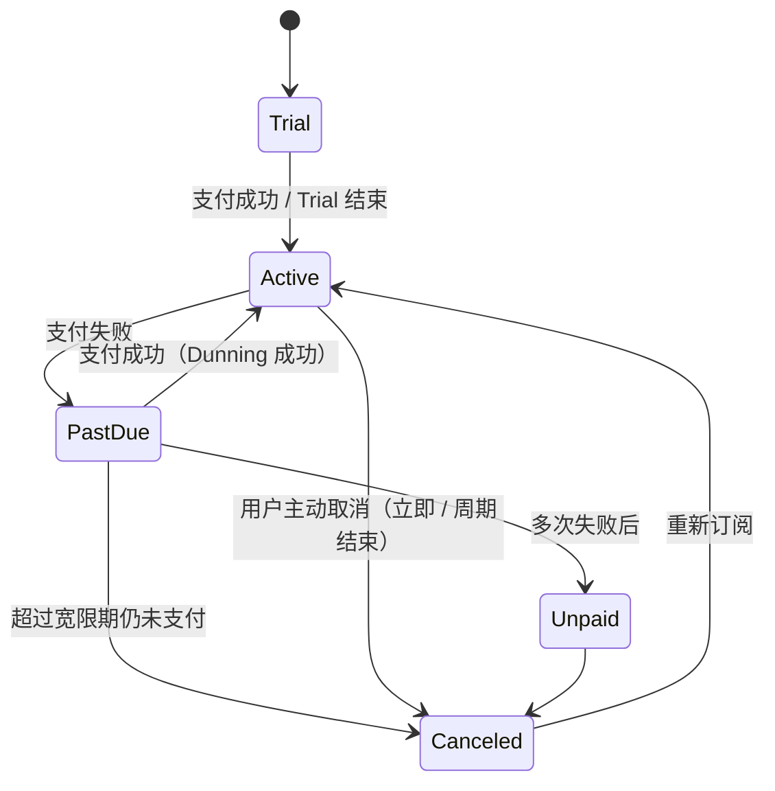

# LiveMask 普通用户订阅全生命周期管理设计 v3.6

**最后更新**：2026-05-10  
**优先级**：P0（必须在 MVP 后尽快补齐）

---

## 一、设计目标

为普通付费用户（非 Sponsor / Promoter）建立完整的订阅生命周期管理能力，实现从获客到流失的全链路自动化运营。

**核心目标**：
- 提升订阅转化率与留存率
- 降低因支付失败导致的流失
- 提供灵活的取消与变更能力
- 支持合规的退款与数据权利处理

---

## 二、订阅状态机（Subscription State Machine）



**状态定义**：

| 状态          | 含义                           | 用户可使用服务？ | 计费？     | 自动操作 |
|---------------|--------------------------------|------------------|------------|----------|
| `trial`       | 试用期                         | 是               | 否         | 试用结束前提醒 |
| `active`      | 正常订阅                       | 是               | 是         | - |
| `past_due`    | 支付失败，进入催收期           | 是（宽限期内）   | 是         | Dunning 重试 |
| `unpaid`      | 多次失败，服务受限             | 部分限制         | 是         | 限制带宽/速度 |
| `canceled`    | 已取消                         | 否（到周期结束） | 否         | 到期后彻底关闭 |
| `expired`     | 已过期                         | 否               | 否         | - |

---

## 三、核心业务流程

### 3.1 订阅创建与支付

- 支持月付 / 季付 / 年付
- 支持 Proration（按比例计费）
- 首次订阅支持 Trial（7/14/30 天可配置）
- 支付失败进入 `past_due`

### 3.2 Dunning Management（催收管理）

**策略**（后台可配置）：

| 失败次数 | 操作                     | 通知方式          |
|----------|--------------------------|-------------------|
| 1        | 立即重试 + 邮件提醒       | Email + 站内信    |
| 2        | 24h 后重试               | Email + Telegram  |
| 3        | 3天后重试 + 限制速度      | Email + 站内信    |
| 4+       | 进入 `unpaid` + 最终提醒  | Email + SMS（可选）|

### 3.3 取消订阅

- **立即取消**：立即停止服务 + 按使用比例退款（可选）
- **周期结束取消**：继续使用到本周期结束，不再自动续费
- 支持**挽留优惠**（在取消页面弹出折扣券 / 降级套餐）

### 3.4 变更套餐（Upgrade / Downgrade）

- Upgrade：立即生效 + Proration 补差价
- Downgrade：下个周期生效

### 3.5 重新激活（Reactivation）

- 已取消用户可随时重新订阅
- 支持从 `canceled` 直接恢复到 `active`

---

## 四、数据库表结构建议

```sql
CREATE TABLE subscriptions (
    id                  UUID PRIMARY KEY,
    user_id             UUID NOT NULL REFERENCES users(id),
    plan_id             UUID NOT NULL,
    status              VARCHAR(20) NOT NULL,           -- trial, active, past_due, unpaid, canceled, expired
    current_period_start TIMESTAMPTZ,
    current_period_end   TIMESTAMPTZ,
    cancel_at_period_end BOOLEAN DEFAULT FALSE,
    canceled_at          TIMESTAMPTZ,
    trial_end            TIMESTAMPTZ,
    created_at           TIMESTAMPTZ DEFAULT NOW(),
    updated_at           TIMESTAMPTZ DEFAULT NOW()
);

CREATE TABLE subscription_events (
    id              UUID PRIMARY KEY,
    subscription_id UUID NOT NULL REFERENCES subscriptions(id),
    event_type      VARCHAR(50) NOT NULL,   -- created, activated, payment_failed, dunning_started, canceled, reactivated...
    metadata        JSONB,
    created_at      TIMESTAMPTZ DEFAULT NOW()
);

CREATE TABLE dunning_attempts (
    id                  UUID PRIMARY KEY,
    subscription_id     UUID NOT NULL,
    attempt_number      INT NOT NULL,
    status              VARCHAR(20),           -- pending, succeeded, failed, abandoned
    next_retry_at       TIMESTAMPTZ,
    created_at          TIMESTAMPTZ DEFAULT NOW()
);
```

### 4.3 subscription_plans 表（完全后台可配置套餐体系）

为了让运营人员在后台灵活配置不同套餐，设计了功能强大的 `subscription_plans` 表。

```sql
CREATE TABLE subscription_plans (
    id                      UUID PRIMARY KEY DEFAULT gen_random_uuid(),
    name                    VARCHAR(100) NOT NULL,                    -- 套餐名称
    description             TEXT,                                     -- 套餐介绍（支持 Markdown）
    image_mobile_url        TEXT,                                     -- 手机端展示图
    image_pc_url            TEXT,                                     -- PC 端展示图
    target_tags             JSONB DEFAULT '[]'::jsonb,                -- 适用客户类型，例如 ["科学上网", "电商", "AI", "游戏"]
    data_allowance_gb       NUMERIC(10,2) NOT NULL DEFAULT 0,         -- 套餐流量（GB），0 表示不限
    validity_days           INTEGER NOT NULL DEFAULT 30,              -- 有效天数
    has_bandwidth_limit     BOOLEAN DEFAULT FALSE,                    -- 是否有带宽限制
    max_bandwidth_mbps      INTEGER,                                  -- 最大带宽（Mbps），仅当 has_bandwidth_limit = true 时生效
    price_usdt              NUMERIC(10,2) NOT NULL,                   -- 价格（USDT）
    billing_cycle           VARCHAR(20) NOT NULL DEFAULT 'monthly' 
                            CHECK (billing_cycle IN ('monthly', 'quarterly', 'yearly')),
    is_active               BOOLEAN DEFAULT TRUE,                     -- 是否上架销售
    sort_order              INTEGER DEFAULT 100,                      -- 排序权重（越小越靠前）
    features                JSONB DEFAULT '{}'::jsonb,                -- 扩展特性（例如 {"support_ipv6": true, "priority_node": false}）
    created_at              TIMESTAMPTZ DEFAULT NOW(),
    updated_at              TIMESTAMPTZ DEFAULT NOW()
);

-- 推荐索引
CREATE INDEX idx_subscription_plans_active_sort ON subscription_plans (is_active, sort_order);
CREATE INDEX idx_subscription_plans_target_tags ON subscription_plans USING GIN (target_tags);
```

**字段详细说明**（完全满足运营配置需求）：

| 字段                    | 类型          | 说明                                      | 运营价值 |
|-------------------------|---------------|-------------------------------------------|----------|
| `name`                  | VARCHAR       | 套餐名称                                  | 清晰展示给用户 |
| `image_mobile_url`      | TEXT          | 手机端产品图                              | 提升移动端转化 |
| `image_pc_url`          | TEXT          | PC 端产品图                               | 提升桌面端转化 |
| `target_tags`           | JSONB         | 适用客户类型标签数组                      | 支持精准推荐与筛选 |
| `data_allowance_gb`     | NUMERIC       | 流量配额（GB）                            | 核心卖点 |
| `validity_days`         | INTEGER       | 有效天数                                  | 灵活支持月/季/年付 |
| `has_bandwidth_limit`   | BOOLEAN       | 是否开启带宽限制                          | 差异化产品策略 |
| `max_bandwidth_mbps`    | INTEGER       | 最大带宽限制（Mbps）                      | 控制低价套餐成本 |
| `price_usdt`            | NUMERIC       | USDT 定价                                 | 统一货币结算 |
| `billing_cycle`         | VARCHAR       | 计费周期                                  | 支持多种付费周期 |
| `features`              | JSONB         | 扩展特性                                  | 未来功能扩展能力强 |

---

## 五、可配置套餐体系（Backend Fully Configurable Plans）

### 5.1 设计原则
- **所有套餐参数均支持后台实时修改**，无需重新部署代码。
- 支持**多维度差异化**：流量、带宽、价格、有效期、适用场景。
- 图片资源独立管理，便于视觉优化。

### 5.2 Admin 后台核心功能
1. **套餐管理列表**
   - 支持按标签、是否上架、价格区间筛选
   - 一键上下架、调整排序

2. **新增/编辑套餐表单**
   - 套餐名称、富文本描述
   - 上传两张图片（手机 + PC，推荐 2:1 或 16:9 比例）
   - 多选标签（科学上网 / 电商 / AI / 游戏 / 其他）
   - 流量设置（支持“不限流量”选项）
   - 有效期设置（天数，支持快速选择 30/90/365 天）
   - 带宽限制开关 + 最大带宽输入框
   - 价格 + 计费周期选择
   - 扩展特性开关（IPv6、优先节点等）

3. **实时预览**
   - 编辑时实时展示用户端最终展示效果

4. **影响分析**
   - 修改价格或流量时，系统提示对现有订阅用户的影响范围

### 5.3 与订阅生命周期的深度联动
- 用户订阅时绑定 `plan_id`，后续所有限速、流量统计、带宽策略均依据当前套餐配置动态下发。
- 套餐变更（Upgrade/Downgrade）时，系统自动根据新套餐的 `has_bandwidth_limit` 和 `max_bandwidth_mbps` 更新用户限速策略。
- Dunning 期间可根据套餐价值提供差异化宽限策略（高价值套餐更宽松）。

### 5.4 技术实现建议
- Admin 端使用 **React Hook Form + Zod** 进行强校验
- 图片上传走独立对象存储（S3 / MinIO）
- `target_tags` 和 `features` 使用 JSONB，便于灵活扩展
- 前端（App + 官网）通过 `/plans` 接口实时获取最新上架套餐列表

---

## 六、与全局系统的闭环

- **支付与订单**：根据 `plan_id` 获取价格和配置创建订单
- **NodeAgent 配置下发**：通过 `vpn_client_governance` 动态注入带宽限制
- **推广大使收益**：用户消费金额计入大使佣金基数
- **流量可视化**：可按 `target_tags` 和套餐类型进行多维度统计
- **质量申诉**：高价值套餐用户可获得更高优先级处理

---

**本次更新要点（2026-05-10）**：
- 新增 `subscription_plans` 完整表结构，覆盖用户所有配置需求（名称、双图片、标签、流量、有效期、带宽限制等）
- 实现**完全后台可配置**的套餐体系，运营人员可实时调整产品策略
- 与订阅生命周期、支付、NodeAgent 配置下发形成完整闭环

所有内容已与之前的设计保持一致。
---

## 五、后台配置项（全部可配置）

- Trial 时长
- Dunning 重试策略（次数、间隔、动作）
- 宽限期时长
- 取消挽留策略
- Proration 开关
- 自动降级套餐（当进入 unpaid 时）

---

## 六、与现有系统的联动

- **支付系统**：与 NOWPayments / BTCPay 回调联动
- **收益模型**：取消/退款需同步更新推广大使佣金（支持追溯）
- **风控**：异常取消/退款进入风控审核
- **通知系统**：Email + Telegram + 站内信多通道

---

**下一步建议**：  
优先实现订阅状态机 + Dunning 引擎 + 取消挽留页面，这是留存率提升最关键的部分。

---

*此文档为框架版，详细接口、状态机代码、定时任务实现可继续补充。*
