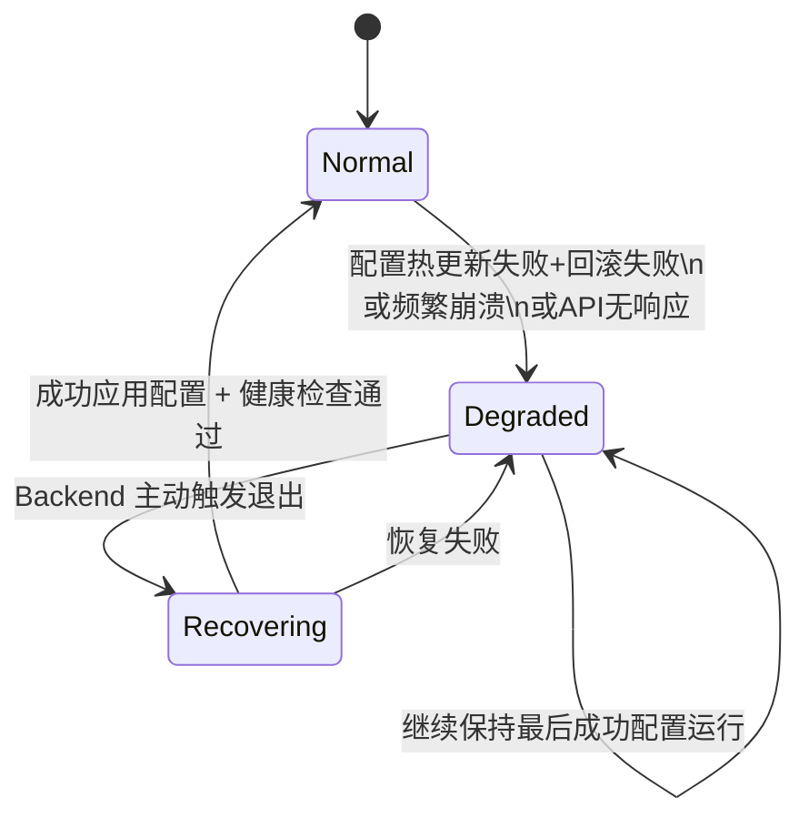

# LiveMask NodeAgent 架构与开发规范 v3.6

## 1. NodeAgent 定位与职责

NodeAgent 是运行在合伙人（Sponsor）服务器上的**核心代理程序**，负责：

- 节点健康与质量数据采集（自研）
- 流量与带宽实时统计（自研）
- sing-box 进程生命周期管理
- 配置热更新接收与应用
- 与后端 API 的安全通信
- 威胁情报黑名单同步（可选）
- 节点状态上报与异常告警

**核心原则**：
- **全部采用自研采集**，不依赖任何第三方监控工具（如 node_exporter），以保证数据可信性和业务闭环。
- **不直接暴露 Prometheus metrics**（默认关闭）。
- 仅在 Feature Flag 开启时，才暴露轻量级 `/metrics` 端点（仅用于内部调试）。
- 实时决策（degraded 模式判断、推荐反馈）继续使用自研心跳路径。
- 长期趋势监控统一由 Backend 聚合后暴露给 Prometheus。

---

## 2. 整体架构

```
┌─────────────────────────────────────────────────────────────┐
│                        NodeAgent                            │
├─────────────────────────────────────────────────────────────┤
│  Collector Layer                                            │
│   ├── TrafficCollector   (网络流量/带宽/连接数)              │
│   ├── SystemCollector    (CPU/内存/磁盘IO/负载)              │
│   └── SingboxCollector   (sing-box 统计接口)                 │
├─────────────────────────────────────────────────────────────┤
│  Reporter Layer                                             │
│   └── 定时聚合 + 批量上报 (node_quality_logs + node_traffic_logs)
├─────────────────────────────────────────────────────────────┤
│  Control Layer                                              │
│   ├── ConfigManager     (配置热更新)                         │
│   ├── SingboxController (进程启停、配置下发)                 │
│   └── Security          (请求签名、证书校验)                 │
├─────────────────────────────────────────────────────────────┤
│  Communication Layer                                        │
│   └── HTTP Client + 重试 + 限流                              │
└─────────────────────────────────────────────────────────────┘
                              │
                              ▼
                    LiveMask Backend API
```

---

## 3. 核心模块设计

### 3.1 Collector 模块（自研采集）

**必须全部自研，不允许使用第三方采集进程。**

| 采集项             | 实现方式                          | 推荐技术                     | 上报表                  |
|--------------------|-----------------------------------|------------------------------|-------------------------|
| 网络流量/带宽      | `/proc/net/dev` + sing-box API    | Go 原生 + HTTP Client        | `node_traffic_logs`     |
| 连接数             | sing-box stats API                | HTTP Client                  | `node_traffic_logs`     |
| CPU / 内存         | `gopsutil`                        | `github.com/shirou/gopsutil` | `node_quality_logs`     |
| 磁盘 I/O           | `gopsutil` + `/proc/diskstats`    | `gopsutil`                   | `node_quality_logs`     |
| 系统负载           | `gopsutil`                        | `gopsutil`                   | `node_quality_logs`     |

**推荐目录结构**：

```go
collector/
├── traffic_collector.go
├── system_collector.go
├── singbox_collector.go
├── reporter.go
└── model/
    └── metrics.go
```

### 3.2 SingboxCollector 实现（sing-box 统计接口）

NodeAgent 通过 **sing-box HTTP API** 获取准确的流量和连接统计数据。

#### sing-box 配置要求（必须开启）

在 sing-box 配置文件中必须包含以下配置：

```json
{
  "experimental": {
    "clash_api": {
      "external_controller": "127.0.0.1:9090",
      "secret": ""
    }
  }
}
```

启动 sing-box 时使用：

```bash
sing-box run -c config.json
```

#### SingboxCollector 代码实现（增强版 - 全局逻辑链视角）

**设计原则**（从 App + NodeAgent + Backend 全局逻辑链出发）：
- sing-box 是 App 用户流量的唯一出口，其稳定性直接影响用户体验。
- NodeAgent 必须对 sing-box 故障进行快速检测 + 自动恢复，并将严重故障上报给 Backend API。
- 采集失败不应导致整个 Agent 崩溃，采用分级错误处理（可恢复 vs 致命）。
- 所有 sing-box 相关操作必须可观测、可追溯（带 Task ID 上下文）。

```go
// collector/singbox_collector.go
package collector

import (
	"context"
	"encoding/json"
	"fmt"
	"net/http"
	"time"
)

type SingboxClient struct {
	baseURL    string
	httpClient *http.Client
}

func NewSingboxClient(baseURL string) *SingboxClient {
	return &SingboxClient{
		baseURL: baseURL,
		httpClient: &http.Client{
			Timeout: 5 * time.Second,
		},
	}
}

// TrafficStats sing-box 返回的流量统计结构（Clash API 兼容）
type TrafficStats struct {
	Up   int64 `json:"up"`
	Down int64 `json:"down"`
}

// GetTraffic 获取当前实时上传/下载速度（单位：bytes/s）
func (c *SingboxClient) GetTraffic(ctx context.Context) (*TrafficStats, error) {
	url := fmt.Sprintf("%s/traffic", c.baseURL)

	req, err := http.NewRequestWithContext(ctx, "GET", url, nil)
	if err != nil {
		return nil, err
	}

	resp, err := c.httpClient.Do(req)
	if err != nil {
		return nil, fmt.Errorf("请求 sing-box traffic 接口失败: %w", err)
	}
	defer resp.Body.Close()

	if resp.StatusCode != http.StatusOK {
		return nil, fmt.Errorf("sing-box traffic 接口返回非 200: %d", resp.StatusCode)
	}

	var stats TrafficStats
	if err := json.NewDecoder(resp.Body).Decode(&stats); err != nil {
		return nil, fmt.Errorf("解析 traffic 数据失败: %w", err)
	}

	return &stats, nil
}

// ConnectionStats 连接统计
type ConnectionStats struct {
	DownloadTotal int64 `json:"downloadTotal"`
	UploadTotal   int64 `json:"uploadTotal"`
	Connections   []struct {
		ID       string `json:"id"`
		Metadata struct {
			Network string `json:"network"`
			Type    string `json:"type"`
		} `json:"metadata"`
	} `json:"connections"`
}

// GetConnections 获取当前活跃连接信息
func (c *SingboxClient) GetConnections(ctx context.Context) (*ConnectionStats, error) {
	url := fmt.Sprintf("%s/connections", c.baseURL)

	req, err := http.NewRequestWithContext(ctx, "GET", url, nil)
	if err != nil {
		return nil, err
	}

	resp, err := c.httpClient.Do(req)
	if err != nil {
		return nil, fmt.Errorf("请求 sing-box connections 接口失败: %w", err)
	}
	defer resp.Body.Close()

	if resp.StatusCode != http.StatusOK {
		return nil, fmt.Errorf("sing-box connections 接口返回非 200: %d", resp.StatusCode)
	}

	var stats ConnectionStats
	if err := json.NewDecoder(resp.Body).Decode(&stats); err != nil {
		return nil, fmt.Errorf("解析 connections 数据失败: %w", err)
	}

	return &stats, nil
}

// GetActiveConnectionsCount 获取当前活跃连接数（简化版）
func (c *SingboxClient) GetActiveConnectionsCount(ctx context.Context) (int, error) {
	stats, err := c.GetConnections(ctx)
	if err != nil {
		return 0, err
	}
	return len(stats.Connections), nil
}
```

**使用示例**（在 Reporter 中调用）：

```go
func (r *Reporter) collectOnce() model.NodeMetrics {
    ctx, cancel := context.WithTimeout(context.Background(), 5*time.Second)
    defer cancel()

    traffic, _ := r.singboxClient.GetTraffic(ctx)
    connCount, _ := r.singboxClient.GetActiveConnectionsCount(ctx)

    return model.NodeMetrics{
        UploadBandwidthMbps:   float64(traffic.Up) * 8 / 1024 / 1024,   // 转为 Mbps
        DownloadBandwidthMbps: float64(traffic.Down) * 8 / 1024 / 1024,
        Connections:           connCount,
        RecordedAt:            time.Now(),
    }
}
```

---

### 3.3 Reporter 上报模块

- 默认每 **60 秒** 采集一次
- 支持后台通过 `system_configs` 动态调整采集频率
- 采用**批量上报**（每 5~10 分钟上报一次），降低后端压力
- 失败时使用指数退避 + 限流

### 3.3 配置与控制模块

- 通过 `/agent/config` 接口拉取最新配置
- 支持配置版本 + Hash 校验
- sing-box 配置下发后自动重启 sing-box 进程（优雅重启）

---

## 4. NodeAgent 注册、鉴权与上线审核流程（重要安全设计）

### 4.1 设计原则（全局逻辑链视角）

从 **App + NodeAgent + Backend** 整个链路来看，NodeAgent 的安全性直接影响整个 VPN 网络的可靠性与可控性。因此必须满足以下要求：

- **唯一标识**：每个 NodeAgent 必须拥有全局唯一的 `node_id`，防止伪造和混淆。
- **启动后端口健康检查**：鉴权成功后，后端必须主动验证 sing-box 端口是否可达，确保节点真正可用。
- **人工审核机制**：新节点必须经过后台管理员人工审核通过后，才能正式成为可被 App 推荐的活跃节点，防止恶意或低质量节点加入网络。

### 4.2 唯一标识设计

NodeAgent 使用以下双重标识：

| 标识          | 类型     | 生成方式                     | 用途                              | 安全性要求 |
|---------------|----------|------------------------------|-----------------------------------|------------|
| `node_id`     | UUID     | Sponsor 在后台注册节点时生成 | 全局唯一标识，写入所有请求 Header | 必须       |
| `node_secret` | 字符串   | Sponsor 注册时生成           | 用于请求签名（HMAC）              | 必须       |

**请求 Header 示例**：
```http
Node-ID: 550e8400-e29b-41d4-a716-446655440000
Signature: HMAC-SHA256(...)
Timestamp: 1712345678
Nonce: random-string
```

### 4.3 启动鉴权 + 端口健康检查流程

NodeAgent 启动后的完整安全流程如下：

1. **启动鉴权**
   - NodeAgent 携带 `node_id` + `Signature` 调用 `/agent/heartbeat` 或 `/agent/register` 接口进行首次鉴权。
   - Backend 验证 `node_id` 是否存在、签名是否正确、节点状态是否允许启动。

2. **端口健康检查（Backend 主动探测）**
   - 鉴权成功后，Backend **主动** 对该节点配置的 sing-box 入站端口进行探测（TCP/UDP 连通性检查）。
   - 探测成功后，记录节点为“端口可达”状态。
   - 若探测失败，Backend 拒绝该节点进入活跃状态，并通知 Sponsor。

3. **状态流转**
   - 新注册节点默认状态为 `pending_review`
   - 只有 **人工审核通过** 后，状态才变为 `approved` → `active`
   - 只有 `active` 状态的节点，才会被 App Client 推荐使用。

### 4.4 NodeAgent 加入审核流程（必须人工审核）

```mermaid
Sponsor 在后台注册节点
        ↓
Backend 生成 node_id + node_secret
        ↓
Sponsor 在服务器上部署并启动 NodeAgent
        ↓
NodeAgent 启动 → 携带 node_id 进行鉴权
        ↓
Backend 验证签名 + 主动探测 sing-box 端口
        ↓
节点状态变为 pending_review（等待人工审核）
        ↓
Admin 在后台审核（查看节点信息、端口探测结果、Sponsor 信息）
        ↓
审核通过 → 节点状态变为 active
        ↓
App Client 可推荐该节点
```

**数据库字段建议**（`nodes` 表）：
- `status`: `pending_review` | `approved` | `active` | `rejected` | `disabled`
- `port_probe_status`: `success` | `failed` | `pending`
- `approved_at`, `approved_by`（管理员 ID）

### 4.5 安全增强点

- 禁止未审核通过的节点上报数据或被 App 使用。
- Backend 应定期对 `active` 节点进行端口健康巡检。
- Sponsor 修改服务器 IP 或端口后，必须重新触发审核流程。
- 推荐在 Admin 后台增加「节点审核」页面，展示端口探测结果、节点信息、历史质量评分等，辅助管理员决策。

---

## 5. 编译、加密与反逆向

### 5.1 编译优化

```bash
# 推荐编译参数
CGO_ENABLED=0 GOOS=linux GOARCH=amd64 go build \
  -ldflags="-s -w -X main.Version=${VERSION}" \
  -trimpath \
  -o live-mask-agent
```

### 5.2 反逆向与加密建议

- 使用 `garble` 进行 Go 代码混淆（强烈推荐）
- 敏感配置（Node Secret、API Key）使用环境变量或加密存储
- 关键逻辑增加完整性校验（Hash 检查）
- 发布时使用 UPX 或自定义压缩 + 混淆

**推荐工具链**：
- `garble`（代码混淆）
- `upx`（可选压缩）
- 自定义启动器做二次解密（进阶）

---

## 6. 远程诊断功能（Remote Diagnostics）

为了支持远程网络问题排查，同时最大程度保障安全性，NodeAgent 提供**结构化指令**的远程诊断能力，而非直接执行任意 Shell 命令。

### 6.1 设计原则（安全优先）

- **严格白名单**：只允许执行预定义的诊断功能，不支持 `sh -c`、`bash -c` 等任意命令执行。
- **参数白名单校验**：对每个诊断命令的参数进行严格校验。
- **执行超时控制**：所有诊断命令强制设置超时（默认 30 秒）。
- **完整审计**：所有下发指令和执行结果必须完整记录到 Backend。
- **长连接复用**：复用现有的 mTLS + 签名长连接通道进行指令下发和结果上报。
- **最小权限**：NodeAgent 执行诊断命令时使用受限的用户和资源限制。

### 6.2 支持的诊断指令（Phase 1）

| 指令类型      | 功能               | 主要参数                          | 说明                     | 优先级 |
|---------------|--------------------|-----------------------------------|--------------------------|--------|
| `ping`        | 连通性测试         | `target`, `count`, `timeout`      | 推荐优先实现             | P0     |
| `traceroute`  | 路由追踪           | `target`, `max_hops`              | -                        | P0     |
| `curl`        | HTTP/HTTPS 测试    | `url`, `timeout`                  | 仅支持 GET 方法          | P0     |
| `dns_lookup`  | DNS 查询           | `domain`, `record_type`           | 支持 A/AAAA/CNAME/MX     | P0     |

### 6.3 消息协议（复用长连接）

**下发指令（Backend → NodeAgent）**：
```json
{
  "type": "command",
  "command_id": "uuid",
  "command_type": "ping",
  "params": {
    "target": "8.8.8.8",
    "count": 4,
    "timeout": 5
  },
  "issued_by": "admin_user_id",
  "timestamp": 1710000000
}
```

**上报结果（NodeAgent → Backend）**：
```json
{
  "type": "command_result",
  "command_id": "uuid",
  "command_type": "ping",
  "status": "success",           // success / failed / timeout
  "result": {
    "stdout": "PING 8.8.8.8 (8.8.8.8) ...",
    "stderr": "",
    "exit_code": 0,
    "duration_ms": 2450
  },
  "timestamp": 1710000032
}
```

### 6.4 NodeAgent 实现建议

建议在 `internal/diagnostics/` 目录下新增模块：

```go
// internal/diagnostics/service.go
type DiagnosticsService struct {
    // ...
}

func (s *DiagnosticsService) HandleCommand(cmd CommandMessage) (*CommandResult, error) {
    switch cmd.CommandType {
    case "ping":
        return s.executePing(cmd.Params)
    case "traceroute":
        return s.executeTraceroute(cmd.Params)
    case "curl":
        return s.executeCurl(cmd.Params)
    case "dns_lookup":
        return s.executeDNSLookup(cmd.Params)
    default:
        return nil, fmt.Errorf("unsupported command type: %s", cmd.CommandType)
    }
}
```

**安全实现要点**：
- 使用 `exec.CommandContext` 并设置超时
- 对所有参数进行白名单校验
- 禁止使用 `Shell` 执行
- 执行结果必须做长度限制和脱敏处理后上报

### 6.5 与现有模块的联动

- 复用现有的 mTLS 长连接和消息签名机制
- 诊断结果通过现有 Reporter 通道上报
- 所有操作记录到 Backend 的 `node_diagnostic_executions` 表

---

## 7. 开发规范与注意事项

### 6.1 必须遵守的规范

1. **全部自研采集**，禁止引入 `node_exporter` 等第三方进程。
2. 所有对外请求必须进行**请求签名** + Timestamp + Nonce 防重放。
3. 配置变更必须通过 `system_configs` 下发，禁止硬编码。
4. 代码中必须添加 `// TASK-XXXX` 注释。
5. 上报数据必须做**本地聚合**，避免频繁请求后端。
6. 必须实现优雅退出（context 控制 + sing-box 进程清理）。

### 6.2 性能与稳定性要求

- Agent 整体内存占用应控制在 **80MB** 以内（推荐 < 50MB）。
- 禁止在采集循环中进行阻塞操作。
- sing-box 进程崩溃后必须自动拉起，并上报异常。
- 网络中断时必须支持本地缓存 + 重连后批量上报。

### 6.3 安全要求

- Node Secret 严禁明文存储在代码或配置文件中。
- 推荐使用 Docker + 非 root 用户运行。
- 定期轮换 Node Secret（通过后台下发新密钥）。

---

## 4. SingboxController 实现（核心控制层）

**全局视角设计原则**：
- sing-box 进程的稳定性直接决定 App 用户的连接质量。
- NodeAgent 必须像“保姆”一样管理 sing-box：启动、监控、健康检查、自动恢复、优雅重载。
- 所有 sing-box 操作必须可观测，并将严重问题上报给 Backend API，形成闭环。

### 4.1 SingboxController 核心职责

- 启动 / 停止 / 重启 sing-box 进程
- 生成并应用 sing-box 配置文件
- 健康检查 + 自动恢复
- 优雅重载配置（优先使用 SIGHUP）
- 暴露 sing-box 健康状态给 Reporter

### 4.2 推荐实现结构

```go
// singbox/controller.go
package singbox

import (
	"context"
	"os"
	"os/exec"
	"sync"
	"syscall"
	"time"
)

type Controller struct {
	configPath string
	cmd        *exec.Cmd
	mu         sync.Mutex
	healthy    bool
}

func NewController(cfgPath string) *Controller {
	return &Controller{configPath: cfgPath}
}

// Start 启动 sing-box 进程
func (c *Controller) Start() error {
	c.mu.Lock()
	defer c.mu.Unlock()

	if c.cmd != nil && c.cmd.Process != nil {
		return nil // 已经运行
	}

	c.cmd = exec.Command("sing-box", "run", "-c", c.configPath)
	c.cmd.Stdout = os.Stdout
	c.cmd.Stderr = os.Stderr

	if err := c.cmd.Start(); err != nil {
		return err
	}

	go c.waitProcess() // 监控进程退出
	c.healthy = true
	return nil
}

// Stop 优雅停止 sing-box
func (c *Controller) Stop() error {
	c.mu.Lock()
	defer c.mu.Unlock()

	if c.cmd == nil || c.cmd.Process == nil {
		return nil
	}

	// 优先发送 SIGTERM
	if err := c.cmd.Process.Signal(syscall.SIGTERM); err != nil {
		return err
	}

	// 等待进程退出，最多等 10 秒
	done := make(chan error, 1)
	go func() { done <- c.cmd.Wait() }()

	select {
	case <-time.After(10 * time.Second):
		_ = c.cmd.Process.Kill()
	case err := <-done:
		return err
	}
	return nil
}

// Restart 重启 sing-box
func (c *Controller) Restart() error {
	_ = c.Stop()
	time.Sleep(1 * time.Second)
	return c.Start()
}

// ApplyConfig 应用新配置（热更新）
func (c *Controller) ApplyConfig(newConfig string) error {
	// 1. 写入新配置文件
	if err := os.WriteFile(c.configPath, []byte(newConfig), 0644); err != nil {
		return err
	}

	// 2. 发送 SIGHUP 进行优雅重载（推荐方式）
	if c.cmd != nil && c.cmd.Process != nil {
		return c.cmd.Process.Signal(syscall.SIGHUP)
	}
	return nil
}

// IsHealthy 返回 sing-box 当前健康状态
func (c *Controller) IsHealthy() bool {
	c.mu.Lock()
	defer c.mu.Unlock()
	return c.healthy
}

func (c *Controller) waitProcess() {
	if c.cmd == nil {
		return
	}
	err := c.cmd.Wait()
	c.mu.Lock()
	c.healthy = false
	c.mu.Unlock()

	// 上报严重故障给 Backend（通过 Reporter 通道）
	// TODO: 通过 channel 上报致命错误
	_ = err
}
```

**关键设计点**：
- 使用 `SIGHUP` 进行配置热更新，对在线连接影响最小。
- 进程退出后自动标记为不健康，并尝试恢复。
- 严重故障时上报 Backend，形成 App → NodeAgent → Backend 闭环。

---

## 5. NodeAgent 部署策略

**全局要求**：NodeAgent 必须稳定运行在合伙人服务器上，不能因为自身问题影响 sing-box。

### 推荐部署方式

- **容器化部署**（强烈推荐）
- 使用 Docker + Kubernetes（或 Docker Compose）
- 资源限制 + 健康检查 + 自动重启

### Docker 最佳实践

- 多阶段构建 + `garble` 混淆
- 非 root 用户运行
- 资源限制（CPU / 内存）
- Liveness + Readiness Probe
- 日志输出到 stdout（由 Docker/K8s 收集）

（详细 Dockerfile 和 entrypoint 脚本已单独提供）

---

## 6. NodeAgent 日志系统与远程 Debug 机制

**设计目标**：
- 结构化日志，便于集中收集和分析
- 支持远程动态开启 Debug 日志（无需重启 Agent）
- 后端管理人员可通过后台触发 NodeAgent 生成详细 debug 日志，用于排错

### 6.1 日志规范

- 使用 Go 1.21+ 官方 `slog`（JSON 格式）
- 必须包含字段：`time`, `level`, `msg`, `node_id`, `task_id`（可选）
- 关键操作必须记录：sing-box 启动/重载、配置更新、上报成功/失败、健康检查结果

### 6.2 远程 Debug 触发机制（重要）

**推荐实现方式**：

1. Backend 通过配置中心下发 `debug_mode: true`
2. NodeAgent 的 `ConfigManager` 监听到配置变更后，动态调整日志级别为 Debug
3. 同时增加更多 sing-box 详细日志输出
4. Debug 模式可设置自动过期时间（例如 30 分钟后自动关闭）

**配置示例**（通过 `system_configs` 或节点专属配置下发）：

```json
{
  "node_agent": {
    "log_level": "info",
    "debug_mode": false,
    "debug_expire_at": "2026-05-10T18:00:00Z"
  }
}
```

当管理员在后台开启某个节点的 Debug 模式后，NodeAgent 会在下一次配置拉取时自动切换为 Debug 日志，并输出更详细的 sing-box 交互信息。

### 6.3 日志收集建议

- 推荐使用 **Loki** + **Promtail** 或 **Fluent Bit** 收集容器日志
- 关键错误日志同时通过现有通知系统（Telegram）告警

---

## 7. 与全局文档关联关系


| 全局文档 | 关联内容 | 说明 |
|----------|----------|------|
| `LiveMask_技术架构文档_v3.6.md` | Agent 采集模块 | 本文档为详细展开版 |
| `LiveMask_系统设计文档_v3.6.md` | 节点质量与流量闭环 | 引用本文档作为数据来源说明 |
| `LiveMask_监控告警机制设计_v3.6.md` | 告警数据来源 | 明确数据来自 Agent 自研采集 |
| `LiveMask_API详细规格_v3.6.md` | Agent 相关接口 | `/agent/*` 接口定义 |
| `LiveMask_数据库详细设计_v3.6.md` | `node_traffic_logs` / `node_quality_logs` | Agent 上报数据表 |

---

## 7. 降级模式详细设计（Degraded Mode Detailed Design）

### 7.1 设计目标

降级模式的核心目标是**在 sing-box 出现严重异常时，主动保护正在服务的用户连接**，同时限制危险操作，给 Backend 足够时间进行远程干预。

**核心原则**：
- **宁可保持旧配置继续运行，也不要让 sing-box 持续崩溃或处于危险状态**
- **自我保护优先于自动恢复**
- **只能由 Backend 主动触发退出**，NodeAgent 自身不能自愈

### 7.2 触发条件（Triggers）

| 触发条件                        | 严重程度 | 是否立即进入降级模式 | 触发次数/时间窗口要求          | 备注 |
|--------------------------------|----------|----------------------|--------------------------------|------|
| 配置热更新失败 + 回滚也失败     | 高       | 是                   | 1次                            | 最常见触发场景 |
| sing-box 进程短时间内频繁崩溃   | 高       | 是                   | 5次 / 10分钟                   | 防止雪崩式重启 |
| sing-box API 长时间无响应       | 高       | 是                   | 连续3次失败（每次间隔30秒）    | 健康检查失败 |
| 内存使用持续严重超限            | 中       | 可选                 | 持续超过阈值超过5分钟          | GOMEMLIMIT 配合 |
| Backend 手动触发（运维干预）    | -        | 是                   | -                              | 紧急情况使用 |

### 7.3 降级模式下的行为边界（严格限制）

进入降级模式后，NodeAgent **必须严格遵守**以下行为：

- **禁止应用任何新配置**（ConfigManager 直接拒绝）
- **禁止自动重启 sing-box 进程**（SingboxController 停止自动恢复逻辑）
- **保持最后一次成功应用的 sing-box 配置继续运行**（保护用户连接）
- **心跳上报中必须携带 `degraded: true`**（Reporter 实时标记）
- **允许 Backend 远程强制执行**：重启 sing-box、强制退出降级模式
- **继续正常采集和上报**流量、质量、系统指标（不影响可观测性）
- **禁止执行可能导致进一步恶化的操作**

### 7.4 降级模式状态机



### 7.5 实现架构与关键组件联动

**ConfigManager（核心状态维护者）**

```go
type ConfigManager struct {
    mu            sync.RWMutex
    degraded      bool
    lastSuccessConfig *model.AgentConfig
    singboxCtrl   *SingboxController
}

func (m *ConfigManager) EnterDegradedMode(reason string) {
    m.mu.Lock()
    defer m.mu.Unlock()
    if m.degraded { return }
    m.degraded = true
    log.Warnf("进入降级模式，原因: %s", reason)
    if m.singboxCtrl != nil {
        m.singboxCtrl.EnterDegradedMode()
    }
}

func (m *ConfigManager) ExitDegradedMode() error {
    m.mu.Lock()
    defer m.mu.Unlock()
    m.degraded = false
    if m.singboxCtrl != nil {
        return m.singboxCtrl.ExitDegradedMode()
    }
    return nil
}

func (m *ConfigManager) IsDegraded() bool {
    m.mu.RLock()
    defer m.mu.RUnlock()
    return m.degraded
}
```

**SingboxController 响应逻辑**

```go
func (c *SingboxController) ApplyConfig(newCfg *model.AgentConfig) error {
    if c.configMgr != nil && c.configMgr.IsDegraded() {
        return fmt.Errorf("当前处于降级模式，拒绝应用新配置")
    }
    // 正常应用逻辑...
    return nil
}
```

### 7.6 退出降级模式流程（只能 Backend 触发）

1. Backend 检测到节点处于 degraded 状态（通过心跳或告警）
2. 管理员/自动系统判断是否可恢复
3. Backend 调用接口：`/internal/agent/degraded-mode/exit` 或重启 sing-box
4. NodeAgent 收到指令后尝试重新拉取最新配置并应用
5. 健康检查通过后退出降级模式，`degraded` 变为 false

**重要**：NodeAgent **禁止** 在 degraded 状态下自行尝试恢复。

### 7.7 与其他机制的深度联动

| 联动模块           | 联动方式                              | 影响 |
|--------------------|---------------------------------------|------|
| 配置热更新         | 失败 → 自动进入降级模式               | 核心触发 |
| 错误恢复策略       | 频繁崩溃 → 进入降级模式               | 保护机制 |
| 心跳上报           | 实时携带 degraded 状态                | 可观测性 |
| 远程控制接口       | Backend 强制退出 / 重启               | 唯一恢复途径 |
| 节点质量评分       | degraded 状态会显著降低质量分         | 商业激励影响 |

### 7.8 监控与告警

- **P0 告警**：节点进入降级模式（立即通知运维）
- **心跳字段**：`degraded` + `degraded_reason` + `last_success_config_version`
- **Prometheus 指标**：`nodeagent_degraded_state`（0/1）

---

## 附录 A：NodeAgent 安全加固 Checklist（v3.6 最终版）

**使用说明**：  
本 Checklist 必须在开发、Code Review、上线前三个阶段强制执行。每个检查项标注了优先级（P0 = 必须，P1 = 强烈推荐，P2 = 建议）。

### 一、二进制构建阶段（编译时必须完成）

- [ ] 使用 `garble -tiny` 进行代码混淆编译
- [ ] 添加 `-ldflags="-s -w"` 去除符号表和调试信息
- [ ] 可选使用 `UPX --best --lzma` 进行二进制压缩（推荐）
- [ ] 在构建脚本中注入版本信息（Version、Commit、BuildTime）
- [ ] 构建产物统一命名为 `live-mask-agent`（或带版本后缀）
- [ ] **禁止**直接分发原始 `go build` 生成的二进制
- [ ] 保留一个未混淆的 Debug 版本供内部开发使用（严禁对外分发）

### 二、运行时安全加固

- [ ] 使用非 root 用户运行 NodeAgent（推荐创建独立用户 `agent`）
- [ ] 通过 `systemd` 或 Docker 设置资源限制（CPU、内存、nofile）
- [ ] 启用 `readOnlyRootFilesystem`（只读根文件系统，推荐）
- [ ] 最小化 Linux Capabilities（`cap_drop: ALL` + 仅保留必要能力）
- [ ] 设置 `GOMEMLIMIT` 限制 Go 运行时内存使用
- [ ] 生产环境启用 `Seccomp` 或 `AppArmor` 配置文件（P1）
- [ ] 禁止 NodeAgent 直接监听公网端口

### 三、网络通信安全

- [ ] NodeAgent 与后端之间**必须使用 mTLS（双向 TLS）**
- [ ] 所有请求必须携带 **Timestamp + Nonce + HMAC 签名**
- [ ] 实现请求签名验证机制（`security/signer.go`）
- [ ] sing-box 仅暴露必要入站端口
- [ ] 所有与后端通信走 HTTPS
- [ ] 对 sing-box 的 HTTP API（Clash API）设置访问密码或 IP 白名单

### 四、配置与密钥安全

- [ ] `node_secret` **严禁硬编码**在二进制或脚本中
- [ ] 敏感配置通过**环境变量**注入（推荐）
- [ ] 配置下发时必须携带 **版本号 + Hash** 进行校验
- [ ] 支持配置签名验证，防止配置被篡改
- [ ] 配置热更新失败时自动触发回滚或进入降级模式
- [ ] 支持 `node_secret` 定期轮换机制（长期规划，P1）

### 五、运行时监控与异常响应

- [ ] 心跳接口中必须携带 `degraded` 状态字段
- [ ] 实现**降级模式**（配置失败、频繁崩溃、内存超限时自动进入）
- [ ] 实现 sing-box 频繁崩溃保护机制（设置重启次数上限）
- [ ] 严重错误自动上报 Backend 并触发 P0 告警
- [ ] 实现 sing-box 进程健康检查 + 自动恢复
- [ ] 支持 Backend 远程强制重启 sing-box 和退出降级模式

### 六、生命周期与部署安全

- [ ] 节点必须经过**人工审核 + 端口健康检查**后才能变为 `active`
- [ ] 未审核通过的节点无法正常提供服务
- [ ] 安装失败时自动上传错误日志到日志系统
- [ ] 使用 `systemd` 管理 NodeAgent（支持开机自启、自动重启）
- [ ] 安装脚本需具备错误处理和重试机制
- [ ] 支持通过一键脚本完成部署（内嵌凭证）
- [ ] 二进制文件必须经过 Garble 混淆后才能分发给 Sponsor

### 七、后端配套安全措施

- [ ] 节点注册后必须进行人工审核
- [ ] 对异常节点（频繁 degraded、端口探测失败）自动降低推荐权重或禁用
- [ ] 支持对单个节点进行远程强制操作（重启、退出降级模式、禁用）
- [ ] 对安装报告进行风控分析，识别异常安装行为
- [ ] 建立节点异常分级告警机制（P0/P1/P2）

**检查阶段建议**：
- 开发阶段：开发人员自检
- Code Review 阶段：重点审查安全相关代码
- 上线前：技术负责人最终复核


---

## 8. 实施建议

1. **第一阶段**：实现 TrafficCollector + SystemCollector + 基础上报
2. **第二阶段**：接入 sing-box 统计接口 + 配置热更新
3. **第三阶段**：加入 garble 混淆 + 请求签名 + 优雅退出
4. **第四阶段**：性能压测 + 长期运行稳定性验证

---

**文档版本**：v3.6  
**最后更新**：2026-05-10  
**维护者**：后端架构组 + Agent 开发组

---

**重要说明**：本文档已从 **App Client + NodeAgent + Backend API** 全局逻辑链角度进行了系统性设计，确保 sing-box 稳定性、配置一致性、数据可信性、以及远程可观测性。