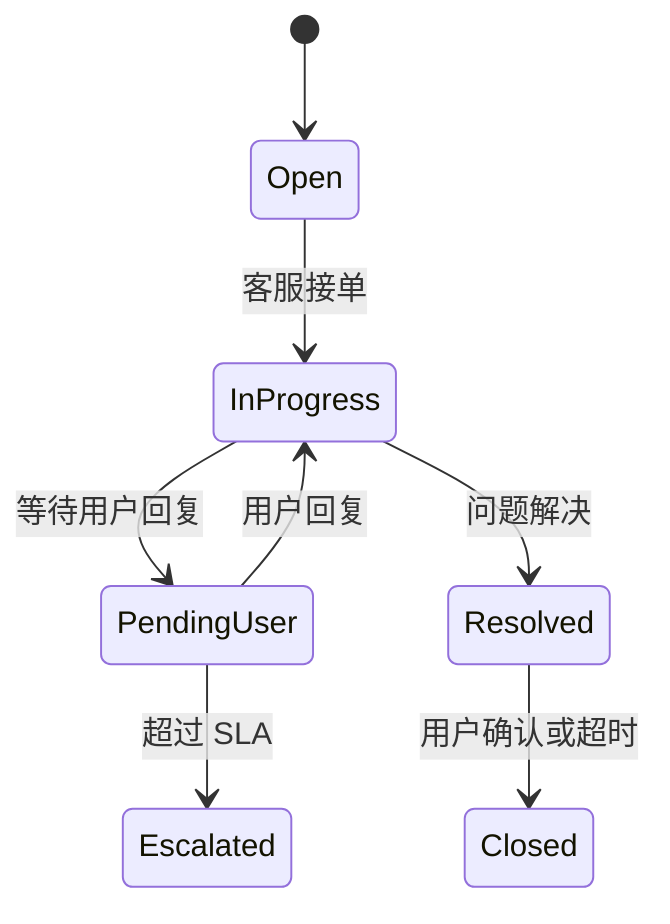

# LiveMask 客户支持系统设计 v3.6（工单 + Telegram 机器人）

**最后更新**：2026-05-10  
**优先级**：P0

---

## 一、设计目标

建立高效、低成本、可规模化的客户支持体系，覆盖普通用户、赞助商、推广大使三类角色。

**核心能力**：
- 用户可通过 **Telegram Bot** 快速提交问题
- 后台支持工单（Ticket）全生命周期管理
- 支持自动回复 + 人工介入
- 与订阅状态、节点状态深度联动

---

## 二、整体架构

```
用户端
├── Telegram Bot（推荐入口）
├── Web 工单提交页（备选）
└── App 内「帮助与反馈」

         ↓

支持系统核心
├── Ticket Service（状态机 + SLA）
├── Knowledge Base（自助服务）
├── Telegram Bot Handler
└── Admin Ticket Dashboard

         ↓

通知与联动
├── Email / Telegram / 站内信
├── 订阅状态联动（用户在 past_due 时自动标记优先级）
└── NodeAgent 状态联动（赞助商节点异常自动创建工单）
```

---

## 三、工单（Ticket）状态机



**状态定义**：

| 状态            | 含义               | SLA 示例          | 可见角色     |
|-----------------|--------------------|-------------------|--------------|
| `open`          | 新建               | -                 | Admin + User |
| `in_progress`   | 处理中             | 4 小时            | Admin + User |
| `pending_user`  | 等待用户回复       | 48 小时           | Admin + User |
| `escalated`     | 已升级             | -                 | Admin + L2   |
| `resolved`      | 已解决             | -                 | Admin + User |
| `closed`        | 已关闭             | -                 | Admin + User |

---

## 四、Telegram Bot 功能设计

**Bot 命令**：

| 命令              | 功能                           | 说明 |
|-------------------|--------------------------------|------|
| `/start`          | 欢迎 + 菜单                    | - |
| `/new_ticket`     | 创建新工单                     | 引导式提问 |
| `/my_tickets`     | 查看我的工单列表               | - |
| `/check_status`   | 查询订阅 / 节点状态            | 联动订阅与节点数据 |
| `/kb`             | 搜索知识库                     | - |
| `/contact`        | 联系人工客服                   | 转人工 |

**智能引导**：
- 用户输入问题后，Bot 先尝试匹配知识库
- 未匹配则引导创建 Ticket
- 创建时自动关联用户订阅状态、节点列表（如果是赞助商）

---

## 五、后台 Ticket 管理功能

**列表页**：
- 筛选：状态、优先级、类型、创建时间、关联用户/节点
- 快速操作：接单、升级、解决、关闭

**详情页**：
- 完整对话记录（支持富文本 + 截图）
- 关联数据快捷查看（订阅信息、节点质量曲线、支付记录）
- 内部备注 + 操作日志
- SLA 倒计时提醒

**自动化规则**（后台可配置）：
- 新 Ticket 自动分配给对应客服组
- 超过 SLA 自动升级 + 通知主管
- 特定关键词自动回复（退款、取消订阅、节点掉线等）

---

## 六、与现有系统的联动

| 联动模块         | 联动方式                                   | 价值 |
|------------------|--------------------------------------------|------|
| **订阅系统**     | 用户在 `past_due` 时创建 Ticket 自动标记高优先级 | 提升留存 |
| **NodeAgent**    | 节点进入 `degraded` 超过 30 分钟自动为 Sponsor 创建 Ticket | 主动服务 |
| **收益系统**     | 退款/取消订阅工单需同步更新推广大使佣金     | 财务准确 |
| **风控系统**     | 异常退款/频繁投诉用户自动标记风控标签       | 风险控制 |

---

## 七、SLA 与绩效

- **响应时间**：普通工单 4 小时内首次回复
- **解决时间**：普通 24 小时，紧急 4 小时
- **客服绩效看板**：响应率、解决率、满意度评分

---

## 八、推荐技术选型

- **后端**：Go + Gin + PostgreSQL
- **Ticket 引擎**：可自研或集成 `Help Scout` / `Zendesk`（初期建议自研降低成本）
- **Telegram Bot**：`telebot` 或 `go-telegram-bot-api`
- **知识库**：Markdown + 向量检索（后期可接入 RAG）

---

**此文档为框架版**，后续可补充：
- 完整 API 接口定义
- Telegram Bot 详细对话流程
- 客服后台 UI Figma 描述
- 自动化规则引擎设计

需要我继续细化哪个部分？